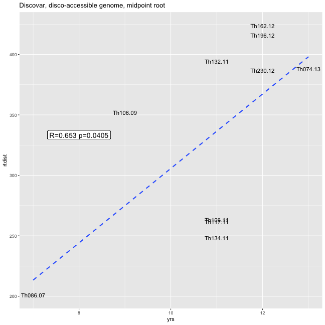
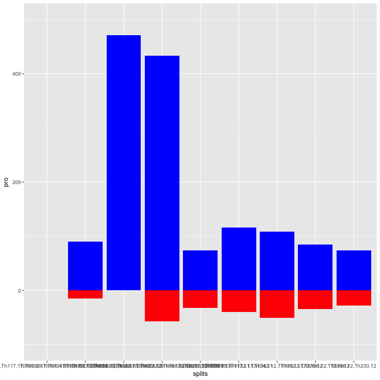
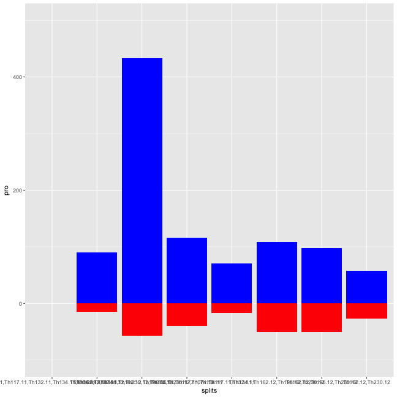
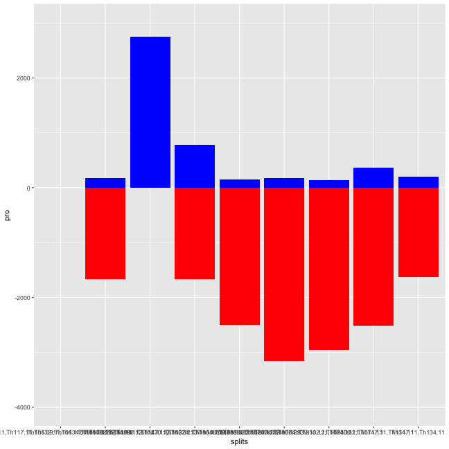
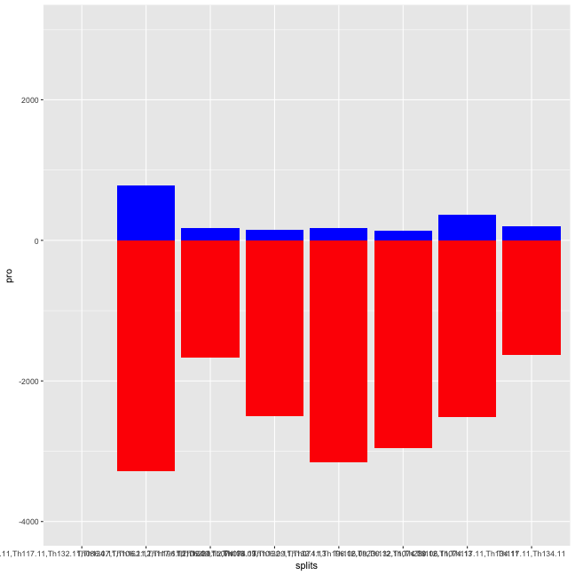

```r
library(ape)
library(adegenet)
library(phangorn)
library(knitr)
library(igraph)
library(RColorBrewer)
library(ggplot2)
library(reshape2)
opts_chunk$set(fig.width=9, fig.height=9)
opts_chunk$set(dev=c('png','postscript'))
```


```r
sym <- function(M) {
  M[lower.tri(M)] = t(M)[lower.tri(M)]
  M
}


makeDist <- function(distance_matrix_file, meta_file, ngroups=3) {
  mat <- read.table(distance_matrix_file,sep="\t")
  D <- as.dist(sym(mat))
  clust <- gengraph(D,ngrp=ngroups)
  names <- colnames(mat)
  mat <- as.matrix(mat)
  
  name1 <- names[clust$clust$membership==1]
  name2 <- names[clust$clust$membership==2]
  name3 <- names[clust$clust$membership==3]
  dist1 <- mat[name1,name1]
  dist2 <- mat[name2,name2]
  dist3 <- mat[name3,name3]
    
  list(dist1,dist2,dist3)
}
```


```r
meta <- read.table("Thies_metadata_1701.txt",sep="\t",header=T)
colnames(meta)[1]<-"name"
meta <- meta[!is.na(meta$Age),]

indelDists <- read.table("Thies_all_manual.PASS.Cls.miss0.5.LMRG.HAP.INDEL.recode.vcf.dist.tab.txt",header=T,sep="\t")
snpDists <- read.table("Thies_all_manual.PASS.Cls.miss0.5.LMRG.HAP.SNP.recode.vcf.dist.tab.txt",header=T,sep="\t")
discoDists <- indelDists+snpDists

meta <- subset(meta,name %in% names(indelDists))
rownames(meta) <- meta$name

gatkDists <- read.table("thies_300100_haplo.CALLHAPLO.RENAME.dist.tab",header=T,sep="\t")

gatkDistsCore <- read.table("thies_300100_haplo.CALLBOTH.RENAME.dist.tab.txt",header=T,sep="\t")
```


```r
cl1 <- c("Th086.07", "Th106.09", "Th106.11", "Th117.11", "Th132.11", "Th134.11", "Th162.12", "Th196.12", "Th230.12", "Th074.13")
cl1yrs <- as.numeric(gsub(".*\\.","",cl1))
og1<-"Th166.12"
oc1 <- c("Th166.12", "Th092.13", "Th211.13", "Th245.13", "Th246.13")
og2<-"Th068.12"
oc2 <- c("Th068.12", "Th061.13", "Th095.13")
cog1 <- c(cl1,og1)
cog2 <- c(cl1,og2)
```


```r
njtree1 <- nj(as.dist(sym(discoDists)))
njtree1 <- midpoint(njtree1)
plot(njtree1)
```


```r
njtree1 <- drop.tip(njtree1,c(oc1,oc2))
plot(njtree1)
```


```r
rtdist1 <- diag(vcv.phylo(njtree1)[cl1,cl1])
TDtab1 <- data.frame("sample"=cl1,"yrs"=cl1yrs,"rtdist"=rtdist1)
ct1 <- cor.test(TDtab1$yrs,TDtab1$rtdist)
ct1
```

```
## 
## 	Pearson's product-moment correlation
## 
## data:  TDtab1$yrs and TDtab1$rtdist
## t = 2.4403, df = 8, p-value = 0.04055
## alternative hypothesis: true correlation is not equal to 0
## 95 percent confidence interval:
##  0.04012092 0.90899971
## sample estimates:
##       cor 
## 0.6532455
```

```r
ggplot(TDtab1,aes(x=yrs,y=rtdist,label=sample)) + geom_text(size=4) + geom_smooth(method = lm,se=F,linetype=2) + 
  geom_label(x=8,y=mean(TDtab1$rtdist),label=paste("R=",round(ct1$estimate,3)," p=",round(ct1$p.value,4),sep=""),size=5) +
  ggtitle("Discovar, disco-accessible genome, midpoint root")
```




```r
alleleTab <- read.table("Thies_all_manual.PASS.Cls.miss0.5.LMRG.HAP.miss-1.alleles.tab",colClasses="character",header=T,na.strings = c("."))
genos <- t(data.matrix(alleleTab[6:dim(alleleTab)[2]]))
inds <- row.names(genos)
genosDat <- as.phyDat(genos, type="USER", levels = c(0:max(genos,na.rm=T)))

fitch(njtree1,genosDat,site = "site")
```

```
##   [1] 0 0 0 0 0 0 0 0 0 0 0 0 0 1 1 0 0 0 1 0 0 0 0 0 1 1 1 1 1 1 1 1 1 1 1
##  [36] 0 0 0 0 0 0 0 1 0 1 1 1 1 1 1 1 1 0 0 0 0 0 1 0 2 1 1 1 1 1 1 1 1 1 1
##  [71] 1 0 0 1 1 0 1 1 1 2 1 1 0 0 1 0 0 0 1 0 2 1 0 0 1 0 0 0 0 0 0 0 2 1 0
## [106] 0 2 1 1 0 2 1 1 1 0 1 0 1 0 1 0 2 2 1 0 0 1 1 0 1 2 1 0 2 2 0 0 1 0 0
## [141] 2 0 3 0 1 1 0 0 0 0 1 1 1 0 0 0 0 0 2 0 1 0 1 1 0 2 1 1 1 0 0 0 0 0 2
## [176] 0 2 1 0 0 0 1 1 0 0 1 0 0 1 2 0 1 1 0 0 1 2 1 1 1 1 1 1 0 1 0 0 0 1 1
## [211] 1 1 1 1 1 2 0 2 1 0 0 1 1 2 0 3 0 0 0 2 1 1 1 0 0 0 1 0 0 1 1 0 0 1 3
## [246] 1 0 0 1
```

```r
parsimony(njtree1,genosDat)
```

```
## [1] 796
```

```r
parsTree <- pratchet(genosDat,njtree1)
```

```
## [1] "Best pscore so far: 796"
## [1] "Best pscore so far: 792"
## [1] "Best pscore so far: 792"
## [1] "Best pscore so far: 792"
## [1] "Best pscore so far: 792"
## [1] "Best pscore so far: 792"
## [1] "Best pscore so far: 792"
## [1] "Best pscore so far: 792"
## [1] "Best pscore so far: 792"
## [1] "Best pscore so far: 792"
## [1] "Best pscore so far: 792"
```

```r
plot(parsTree)
```


```r
lento(parsTree)
```


```r
plot(njtree1)
```


```r
lento(njtree1)
```


```r
?lento
```


```r
getSplitSupports <- function(tree,genos) {
    
#  samps <- c(1:dim(genos)[[1]])
  samps <- tree$tip.label
  
  splitSupports <- data.frame(splits=character(),
                              null=numeric(),
                              irrelevant=numeric(),
                              pro=numeric(),
                              anti=numeric(),
                              stringsAsFactors = F)
  
  splits <- as.splits(tree)
  for (si in c(1:length(splits))) {
    split <- samps[splits[[si]]]
    outs <- samps[!samps %in% split]
    if (length(split)==1) {next}
    
  #  write(split,stderr())
    calcs <- apply(genos,2,function(x) {
      sAll <- na.omit(unique(x[split]))
      oAll <- na.omit(unique(x[outs]))
      comm <- intersect(sAll,oAll)
      sLen <- length(sAll)
      oLen <- length(oAll)
      cLen <- length(comm)
      if (sLen > 2) {sLen<-2}
      if (oLen > 2) {oLen<-2}
      if (cLen > 1) {cLen<-1}
      cat <- paste(c(sLen,cLen,oLen),sep="",collapse="")
      if (sLen==0 | oLen==0 | cat =="111") {
        return("null") #if null or monomorphic
      }
      if (cat %in% c("101","102","201","202")) {
        return("support")
      }
      if (cat %in% c("112","211")) {
        return("no support")
      }
      if (cat == "212") {
        return("against")
      }
      write(cat,stderr())
        return(cat)
      })
   
      #write(table(calcs),stderr()) 
      # write(paste(split,sep=",",collapse =","),stderr())
      # write(table(calcs)[c("null","no support","support","against")],stderr())
      nextI = dim(splitSupports)[[1]]+1
      splitSupports[nextI,"splits"] = paste(split,sep=",",collapse =",")
      counts <- table(calcs)[c("null","no support","support","against")]
      counts[is.na(counts)] <- 0
      splitSupports[nextI,c("null","irrelevant","pro","anti")] = counts
      
  }
  
  return(splitSupports)
}
```


```r
njSupp <- getSplitSupports(njtree1,genos[cl1,])
parsSupp <- getSplitSupports(parsTree,genos[cl1,])

ggplot(njSupp,aes(x=splits)) + geom_bar(aes(y=pro),stat="identity",fill="blue") + geom_bar(aes(y=(anti*-1)),stat="identity",fill="red") + ylim(-100,500)
```



```r
ggplot(parsSupp,aes(x=splits)) + geom_bar(aes(y=pro),stat="identity",fill="blue") + geom_bar(aes(y=(anti*-1)),stat="identity",fill="red") + ylim(-100,500)
```




```r
njtreeGATK <- nj(as.dist(sym(gatkDists)))
njtreeGATK <- midpoint(njtreeGATK)
plot(njtreeGATK)
```


```r
njtreeGATK <- drop.tip(njtreeGATK,c(oc1,oc2))
plot(njtreeGATK)
```


```r
alleleTabGATK <- read.table("thies_300100_haplo.CALLBOTH.RENAME.alleles.tab",colClasses="character",header=T,na.strings = c("."))
genosGATK <- t(data.matrix(alleleTabGATK[6:dim(alleleTabGATK)[2]]))

inds <- row.names(genosGATK)
genosDatGATK <- as.phyDat(genosGATK, type="USER", levels = c(0:max(genosGATK,na.rm=T)))

parstreeGATK <- pratchet(genosDatGATK,njtreeGATK)
```

```
## [1] "Best pscore so far: 5420"
## [1] "Best pscore so far: 5331"
## [1] "Best pscore so far: 5331"
## [1] "Best pscore so far: 5331"
## [1] "Best pscore so far: 5331"
## [1] "Best pscore so far: 5331"
## [1] "Best pscore so far: 5331"
## [1] "Best pscore so far: 5331"
## [1] "Best pscore so far: 5331"
## [1] "Best pscore so far: 5331"
## [1] "Best pscore so far: 5331"
```


```r
njSuppGATK <- getSplitSupports(njtreeGATK,genosGATK[cl1,])
parsSuppGATK <- getSplitSupports(parstreeGATK,genosGATK[cl1,])

ggplot(njSuppGATK,aes(x=splits)) + geom_bar(aes(y=pro),stat="identity",fill="blue") + geom_bar(aes(y=(anti*-1)),stat="identity",fill="red") + ylim(-4000,3000)
```



```r
ggplot(parsSuppGATK,aes(x=splits)) + geom_bar(aes(y=pro),stat="identity",fill="blue") + geom_bar(aes(y=(anti*-1)),stat="identity",fill="red") + ylim(-4000,3000)
```



