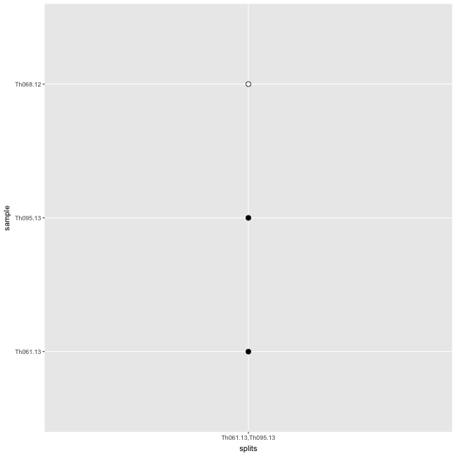
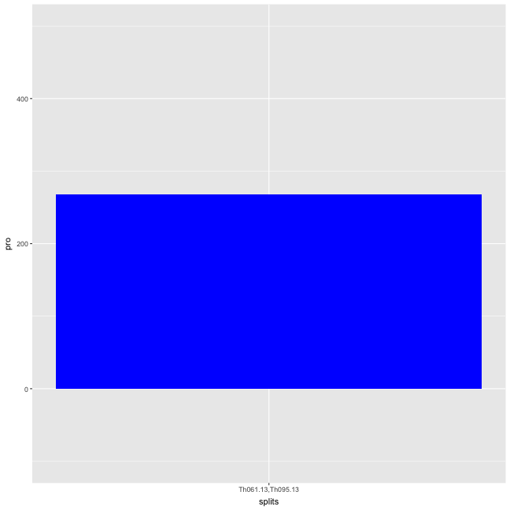
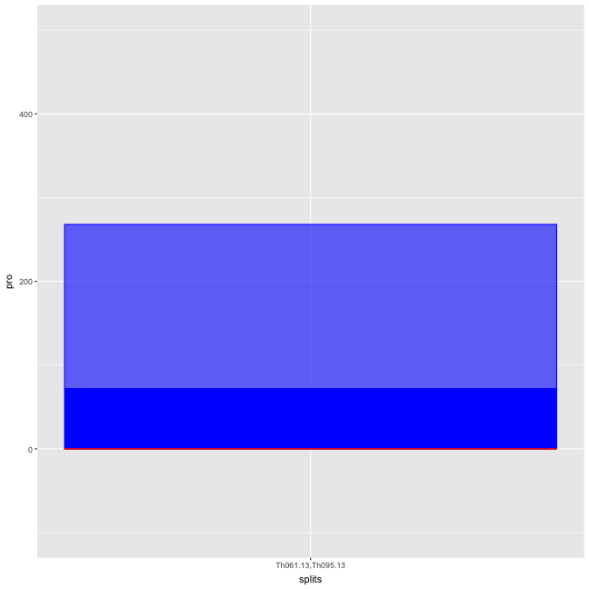
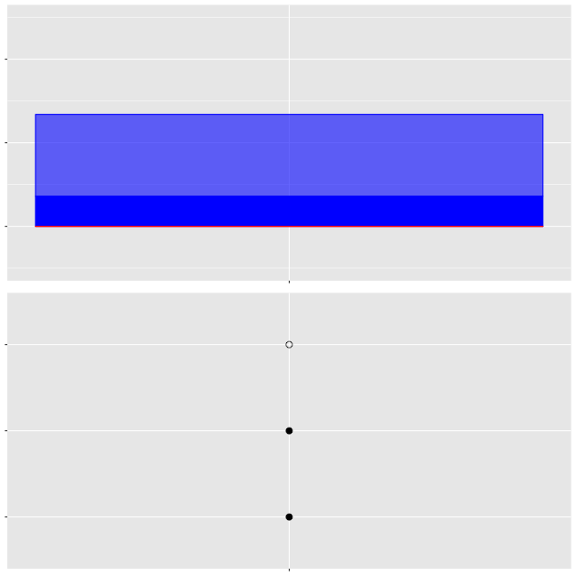
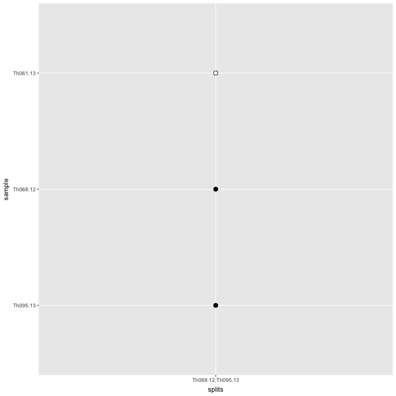
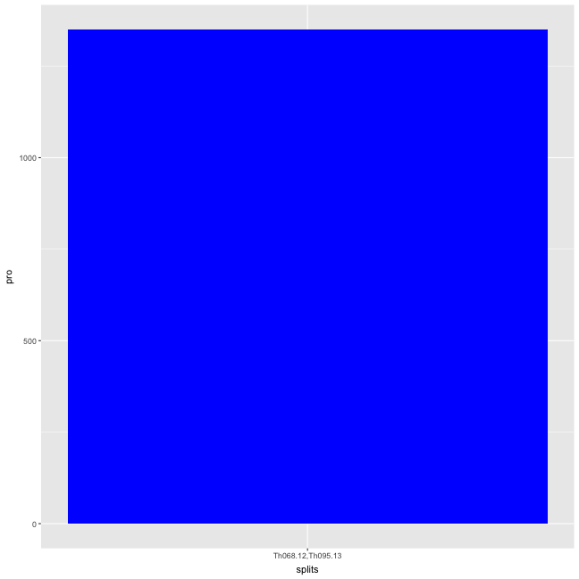
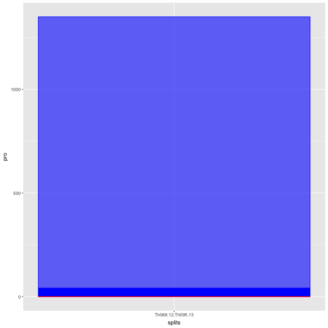
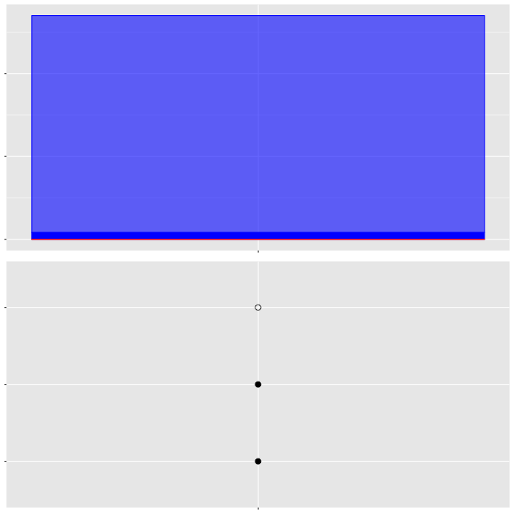

```r
library(ape)
library(adegenet)
library(phangorn)
library(knitr)
library(igraph)
library(RColorBrewer)
library(ggplot2)
library(reshape2)

require(gridExtra)


opts_chunk$set(fig.width=9, fig.height=9)
opts_chunk$set(dev=c('png','postscript'))
```


```r
sym <- function(M) {
  M[lower.tri(M)] = t(M)[lower.tri(M)]
  M
}


makeDist <- function(distance_matrix_file, meta_file, ngroups=3) {
  mat <- read.table(distance_matrix_file,sep="\t")
  D <- as.dist(sym(mat))
  clust <- gengraph(D,ngrp=ngroups)
  names <- colnames(mat)
  mat <- as.matrix(mat)
  
  name1 <- names[clust$clust$membership==1]
  name2 <- names[clust$clust$membership==2]
  name3 <- names[clust$clust$membership==3]
  dist1 <- mat[name1,name1]
  dist2 <- mat[name2,name2]
  dist3 <- mat[name3,name3]
    
  list(dist1,dist2,dist3)
}
```


```r
getSplitSupports <- function(tree,genos) {
    
#  samps <- c(1:dim(genos)[[1]])
  samps <- tree$tip.label
  
  splitSupports <- data.frame(splits=character(),
                              null=numeric(),
                              irrelevant=numeric(),
                              pro=numeric(),
                              anti=numeric(),
                              stringsAsFactors = F)
  
  splits <- as.splits(tree)
  write(paste(c((length(samps)+1):length(splits)),sep=", "),stderr())
  for (si in c((length(samps)+1):length(splits))) {
    split <- samps[splits[[si]]]
    outs <- samps[!samps %in% split]
    #if (length(split)==1) {next}
    if (length(split)==length(samps)) {next}
    
  #  write(split,stderr())
    calcs <- apply(genos,2,function(x) {
      sAll <- na.omit(unique(x[split]))
      oAll <- na.omit(unique(x[outs]))
      comm <- intersect(sAll,oAll)
      sLen <- length(sAll)
      oLen <- length(oAll)
      cLen <- length(comm)
      if (sLen > 2) {sLen<-2}
      if (oLen > 2) {oLen<-2}
      if (cLen > 1) {cLen<-1}
      cat <- paste(c(sLen,cLen,oLen),sep="",collapse="")
      if (sLen==0 | oLen==0 | cat =="111") {
        return("null") #if null or monomorphic
      }
      if (cat %in% c("101","102","201","202")) {
        return("support")
      }
      if (cat %in% c("112","211")) {
        return("no support")
      }
      if (cat == "212") {
        return("against")
      }
      write(cat,stderr())
        return(cat)
      })
   
      #write(table(calcs),stderr()) 
      # write(paste(split,sep=",",collapse =","),stderr())
      # write(table(calcs)[c("null","no support","support","against")],stderr())
      nextI = dim(splitSupports)[[1]]+1
      splitSupports[nextI,"splits"] = paste(split,sep=",",collapse =",")
      counts <- table(calcs)[c("null","no support","support","against")]
      counts[is.na(counts)] <- 0
      splitSupports[nextI,c("null","irrelevant","pro","anti")] = counts
      
  }
  
  return(splitSupports)
}

getSplitPlot <- function(tree) {
    
#  samps <- c(1:dim(genos)[[1]])
  samps <- tree$tip.label
  
  splitPlot <- data.frame(splits=character(),
                          sample=character(),
                          insplit=numeric(),
                          stringsAsFactors = F)
  
  splits <- as.splits(tree)
  write(paste(c((length(samps)+1):length(splits)),sep=", "),stderr())
  for (si in c((length(samps)+1):length(splits))) {
    split <- samps[splits[[si]]]
    outs <- samps[!samps %in% split]
    #if (length(split)==1) {next}
    if (length(split)==length(samps)) {next}
    
    splitStr = paste(split,sep=",",collapse =",")
    
    write(paste(si,splitStr,length(splits)),stderr())
    for (s in split) {
      nextI = dim(splitPlot)[[1]]+1
      splitPlot[nextI,"splits"] = splitStr
      splitPlot[nextI,"sample"] = s
      splitPlot[nextI,"insplit"] = 1}
    for (s in outs) {
      nextI = dim(splitPlot)[[1]]+1
      splitPlot[nextI,"splits"] = splitStr
      splitPlot[nextI,"sample"] = s
      splitPlot[nextI,"insplit"] = 0}
    
      
  }
  
  treeOrder <- tree$tip.label[tree$edge[c(tree$edge[,2] <= length(tree$tip.label)),2]]
  splitPlot$sample <- factor(splitPlot$sample,levels=treeOrder,ordered=T)
  splitPlot$insplit <- as.logical(splitPlot$insplit)
  return(splitPlot)
}

blankTheme <- theme(axis.title=element_blank(),axis.text = element_blank())
blankThemeLab <- theme(axis.title=element_blank(),axis.text.y = element_blank(),
                    axis.text.x=element_text(angle=90,hjust=1))
```


```r
meta <- read.table("Thies_metadata_1701.txt",sep="\t",header=T)
colnames(meta)[1]<-"name"
meta <- meta[!is.na(meta$Age),]

indelDists <- read.table("Thies_all_manual.PASS.Cls.miss0.5.LMRG.HAP.INDEL.recode.vcf.dist.tab.txt",header=T,sep="\t")
snpDists <- read.table("Thies_all_manual.PASS.Cls.miss0.5.LMRG.HAP.SNP.recode.vcf.dist.tab.txt",header=T,sep="\t")
discoDists <- indelDists+snpDists

meta <- subset(meta,name %in% names(indelDists))
rownames(meta) <- meta$name

gatkDists <- read.table("thies_300100_haplo.CALLHAPLO.RENAME.dist.tab",header=T,sep="\t")

gatkDistsCore <- read.table("thies_300100_haplo.CALLBOTH.RENAME.dist.tab.txt",header=T,sep="\t")
```


```r
cl1 <- c("Th086.07", "Th106.09", "Th106.11", "Th117.11", "Th132.11", "Th134.11", "Th162.12", "Th196.12", "Th230.12", "Th074.13")
cl2 <- c("Th166.12", "Th092.13", "Th211.13", "Th245.13", "Th246.13")
cl3 <- c("Th068.12", "Th061.13", "Th095.13")
```


#MAKE DISCOVAR TREES

```r
alleleTab <- read.table("Thies_all_manual.PASS.Cls.miss0.5.LMRG.HAP.miss-1.alleles.tab",colClasses="character",header=T,na.strings = c("."))
genos <- t(data.matrix(alleleTab[6:dim(alleleTab)[2]]))
inds <- row.names(genos)
genosDat <- as.phyDat(genos, type="USER", levels = c(0:max(genos,na.rm=T)))

njtree1 <- nj(as.dist(sym(discoDists)))
njtree1 <- midpoint(njtree1)
njtree1 <- drop.tip(njtree1,c(cl1,cl2))
#plot(njtree1)

parsTree <- pratchet(genosDat) # ,njtree1)
```

```
## [1] "Best pscore so far: 23264"
## [1] "Best pscore so far: 23263"
## [1] "Best pscore so far: 23263"
## [1] "Best pscore so far: 23263"
## [1] "Best pscore so far: 23263"
## [1] "Best pscore so far: 23263"
## [1] "Best pscore so far: 23263"
## [1] "Best pscore so far: 23263"
## [1] "Best pscore so far: 23263"
## [1] "Best pscore so far: 23263"
## [1] "Best pscore so far: 23263"
```

```r
parsTree <- nnls.phylo(parsTree,dist.hamming(genosDat))
parsTree <- midpoint(parsTree)
write.nexus(parsTree,file="tree_all_disco.nexus")

parsTree <- drop.tip(parsTree,c(cl1,cl2))
#plot(parsTree)
```


#MAKE HAP CALLER TREES

```r
alleleTabGATK <- read.table("thies_300100_haplo.CALLBOTH.RENAME.alleles.tab",colClasses="character",header=T,na.strings = c("."))
genosGATK <- t(data.matrix(alleleTabGATK[6:dim(alleleTabGATK)[2]]))
indsGATK <- row.names(genosGATK)
genosDatGATK <- as.phyDat(genosGATK, type="USER", levels = c(0:max(genosGATK,na.rm=T)))


njtreeGATK <- nj(as.dist(sym(gatkDists)))
njtreeGATK <- midpoint(njtreeGATK)
njtree1 <- drop.tip(njtreeGATK,c(cl1,cl2))
#plot(njtreeGATK)

parstreeGATK <- pratchet(genosDatGATK)
```

```
## [1] "Best pscore so far: 32311"
## [1] "Best pscore so far: 32311"
## [1] "Best pscore so far: 32311"
## [1] "Best pscore so far: 32311"
## [1] "Best pscore so far: 32311"
## [1] "Best pscore so far: 32311"
## [1] "Best pscore so far: 32311"
## [1] "Best pscore so far: 32311"
## [1] "Best pscore so far: 32311"
## [1] "Best pscore so far: 32311"
```

```r
parstreeGATK <- nnls.phylo(parstreeGATK,as.dist(sym(gatkDists)))
parstreeGATK <- midpoint(parstreeGATK)
write.nexus(parstreeGATK,file="tree_all_haplo.nexus")

parstreeGATK <- drop.tip(parstreeGATK,c(cl1,cl2))
#plot(parstreeGATK)
```


```r
discoLocs <- paste(alleleTab[,1],alleleTab[,2])
haploLocs <- paste(alleleTabGATK[,1],alleleTabGATK[,2])

hapInDisc <- as.logical(haploLocs %in% discoLocs)
sum(hapInDisc) / length(haploLocs)
```

```
## [1] 0.2628966
```

```r
discInHap <- as.logical(discoLocs %in% haploLocs)
sum(discInHap) / length(discoLocs)
```

```
## [1] 0.4450473
```

```r
as.splits(parsTree)[11:19] %in% as.splits(parstreeGATK)[11:19]
```

```
## [1] TRUE TRUE TRUE TRUE TRUE TRUE TRUE TRUE TRUE
```

```r
as.splits(parstreeGATK)[11:19] %in% as.splits(parsTree)[11:19]
```

```
## [1] TRUE TRUE TRUE TRUE TRUE TRUE TRUE TRUE TRUE
```


```r
njSupp <- getSplitSupports(njtree1,genos[cl3,])
parsSupp <- getSplitSupports(parsTree,genos[cl3,])

njSplits <- getSplitPlot(njtree1)

splitSort <- njSupp$splits[rev(order(njSupp$pro))]


njSplits$splits <- factor(njSplits$splits,levels=splitSort, ordered=T)
njSupp$splits <- factor(njSupp$splits,levels=splitSort, ordered=T)

#splitP <- ggplot(splitTab,aes(x=splits,y=sample,fill=as.logical(insplit))) + geom_point(shape=21, size=3)
splitP <- ggplot(njSplits,aes(x=splits,y=sample,fill=insplit)) + geom_point(shape=21, size=3) + scale_fill_manual(values=c(NA,"black"),guide=F)
#splitP


njsupP <- ggplot(njSupp,aes(x=splits)) + geom_bar(aes(y=pro),stat="identity",fill="blue") + geom_bar(aes(y=(anti*-1)),stat="identity",fill="red") + ylim(-100,500)
#njsupP


#par(mfrow=c(2,2))
#plot(njtree1)
#grid.arrange(njsupP + blankTheme, splitP+blankTheme, ncol=1)
#njsupP + blankTheme
#splitP + blankThemeLab
```


```r
parsSupp <- getSplitSupports(parsTree,genos[cl3,])
parsSuppIn <- getSplitSupports(parsTree,genos[cl3,discInHap])
parsSuppOut <- getSplitSupports(parsTree,genos[cl3,!discInHap])
parsSuppIn$inHap=T
parsSuppOut$inHap=F
parsSuppComb = rbind(parsSuppIn,parsSuppOut)

parsSplits <- getSplitPlot(parsTree)

parsSplitSort <- parsSupp$splits[rev(order(parsSupp$pro))]


parsSplits$splits <- factor(parsSplits$splits,levels=parsSplitSort, ordered=T)
parsSupp$splits <- factor(parsSupp$splits,levels=parsSplitSort, ordered=T)
parsSuppComb$splits <- factor(parsSuppComb$splits,levels=parsSplitSort, ordered=T)

#splitP <- ggplot(splitTab,aes(x=splits,y=sample,fill=as.logical(insplit))) + geom_point(shape=21, size=3)
splitP <- ggplot(parsSplits,aes(x=splits,y=sample,fill=as.logical(insplit))) + geom_point(shape=21, size=3) + scale_fill_manual(values=c(NA,"black"),guide=F)
splitP
```



```r
parssupP <- ggplot(parsSupp,aes(x=splits)) + geom_bar(aes(y=pro),stat="identity",fill="blue") + geom_bar(aes(y=(anti*-1)),stat="identity",fill="red") + ylim(-100,500)
parssupP
```



```r
parssupP <- ggplot(parsSuppComb,aes(x=splits,alpha=inHap)) + geom_bar(aes(y=pro),stat="identity",fill="blue",colour="blue") + geom_bar(aes(y=(anti*-1)),stat="identity",fill="red",colour="red") + ylim(-100,500) + scale_alpha_manual(values=c(0.6,1),guide=F)
parssupP
```



```r
# par(mfrow=c(2,2))
plot(parsTree)
```


```r
# parssupP + blankTheme
# splitP + blankTheme
write.nexus(parsTree,file = "parsimony_tree_Disco.nexus")


grid.arrange(parssupP + blankTheme, splitP+blankTheme, ncol=1)
```




```r
parsSuppGATK <- getSplitSupports(parstreeGATK,genosGATK[cl3,])

parsSuppGATKin <- getSplitSupports(parstreeGATK,genosGATK[cl3,hapInDisc])
parsSuppGATKout <- getSplitSupports(parstreeGATK,genosGATK[cl3,!hapInDisc])
parsSuppGATKin$inDisco <- T
parsSuppGATKout$inDisco <- F
parsSuppGATKcomb <- rbind(parsSuppGATKin,parsSuppGATKout)


parsSplitsGATK <- getSplitPlot(parstreeGATK)

parsSplitSortGATK <- parsSuppGATK$splits[rev(order(parsSuppGATK$pro))]


parsSplitsGATK$splits <- factor(parsSplitsGATK$splits,levels=parsSplitSortGATK, ordered=T)
parsSuppGATK$splits <- factor(parsSuppGATK$splits,levels=parsSplitSortGATK, ordered=T)
parsSuppGATKcomb$splits <- factor(parsSuppGATKcomb$splits,levels=parsSplitSortGATK, ordered=T)

#splitP <- ggplot(splitTab,aes(x=splits,y=sample,fill=as.logical(insplit))) + geom_point(shape=21, size=3)
splitGATKP <- ggplot(parsSplitsGATK,aes(x=splits,y=sample,fill=as.logical(insplit))) + geom_point(shape=21, size=3) + scale_fill_manual(values=c(NA,"black"),guide=F)
splitGATKP
```



```r
parssupGATKP <- ggplot(parsSuppGATK,aes(x=splits)) + geom_bar(aes(y=pro),stat="identity",fill="blue") + geom_bar(aes(y=(anti*-1)),stat="identity",fill="red") 
parssupGATKP
```



```r
parssupGATKP <- ggplot(parsSuppGATKcomb,aes(x=splits,alpha=inDisco)) + geom_bar(aes(y=pro),stat="identity",fill="blue",colour="blue") + geom_bar(aes(y=(anti*-1)),stat="identity",fill="red",colour="red") + scale_alpha_manual(values=c(0.6,1),guide=F)
parssupGATKP
```



```r
# par(mfrow=c(2,2))
plot(parstreeGATK)
```


```r
# parssupP + blankTheme
# splitP + blankTheme
write.nexus(parstreeGATK,file = "parsimony_tree_GATK.nexus")

grid.arrange(parssupGATKP + blankTheme, splitGATKP+blankTheme, ncol=1)
```




```r
#percent support Discovar:
write.table(round(parsSupp[,3:5] / rowSums(parsSupp[,3:5]),2),sep="\t",quote=F)
```

```
## irrelevant	pro	anti
## 1	0.5	0.5	0
```

```r
mean(parsSupp[,4]/rowSums(parsSupp[,4:5]))
```

```
## [1] 1
```

```r
write.table(parsSupp[,3:5],quote=F) 
```

```
## irrelevant pro anti
## 1 272 268 0
```

```r
#percent support HapCaller:
write.table(round(parsSuppGATK[,3:5] / rowSums(parsSuppGATK[,3:5]),2),sep="\t",quote=F)
```

```
## irrelevant	pro	anti
## 1	0.57	0.43	0
```

```r
mean(parsSupp[,4]/rowSums(parsSuppGATK[,4:5]))
```

```
## [1] 0.1985185
```

```r
write.table(parsSuppGATK[,3:5],quote=F)
```

```
## irrelevant pro anti
## 1 1765 1350 0
```

