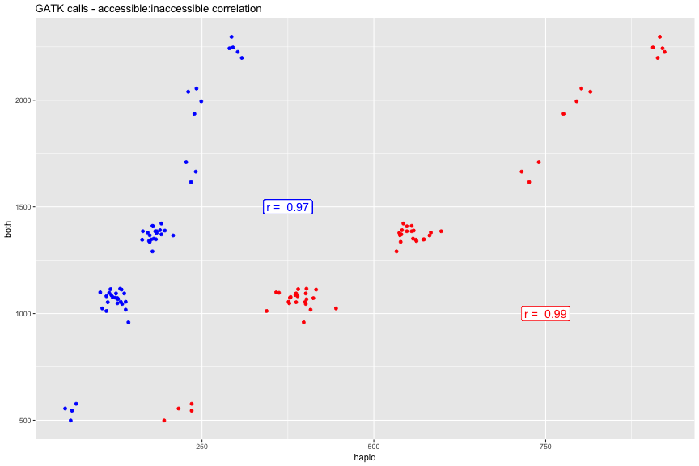

```r
library(ggplot2)
library(hexbin)
library(reshape2)
library(knitr)

library(gridExtra)
library(grid)
library(ggplot2)
library(lattice)
opts_chunk$set(fig.width=12, fig.height=8,dev=c('png','postscript'),warning=F)
```


```r
g_legend<-function(a.gplot){
  tmp <- ggplot_gtable(ggplot_build(a.gplot))
  leg <- which(sapply(tmp$grobs, function(x) x$name) == "guide-box")
  legend <- tmp$grobs[[leg]]
  return(legend)}
```


```r
callboth <- read.table("Thies_all_manual.PASS.Cls.miss0.5.LMRG.HAP.CALLBOTH.vcf.dist.tab.txt",sep="\t")
callboth$from=rownames(callboth)
callboth <- melt(callboth,variable.name = "to",value.name="both")
```

```
## Using from as id variables
```

```r
callDisco <- read.table("Thies_all_manual.PASS.Cls.miss0.5.LMRG.HAP.CALLDISCOONLY.vcf.dist.tab.txt",sep="\t")
callDisco$from=rownames(callDisco)
callDisco <- melt(callDisco,variable.name = "to",value.name="disco")
```

```
## Using from as id variables
```

```r
callsnp <- read.table("Thies_all_manual.PASS.Cls.miss0.5.LMRG.HAP.SNP.recode.vcf.dist.tab.txt",sep="\t")
callsnp $from=rownames(callsnp )
callsnp  <- melt(callsnp ,variable.name = "to",value.name="snp")
```

```
## Using from as id variables
```

```r
callindel <- read.table("Thies_all_manual.PASS.Cls.miss0.5.LMRG.HAP.INDEL.recode.vcf.dist.tab.txt",sep="\t")
callindel $from=rownames(callindel )
callindel  <- melt(callindel ,variable.name = "to",value.name="indel")
```

```
## Using from as id variables
```

```r
callCf <- merge(merge(callboth,callDisco),merge(callsnp,callindel))
callCf <- callCf[!is.na(callCf$snp),]
callCf <- callCf[callCf$from != callCf$to,]

callCf <- callCf[callCf$snp <= 1000,]

callbothGATK <- read.table("thies_300100_haplo.CALLBOTH.RENAME.dist.tab.txt",sep="\t")
callbothGATK$from=rownames(callbothGATK)
callbothGATK <- melt(callbothGATK,variable.name = "to",value.name="both")
```

```
## Using from as id variables
```

```r
callhaploGATK <- read.table("thies_300100_haplo.CALLHAPLO.RENAME.dist.tab.txt",sep="\t")
callhaploGATK$from=rownames(callhaploGATK)
callhaploGATK <- melt(callhaploGATK,variable.name = "to",value.name="haplo")
```

```
## Using from as id variables
```

```r
calldiscoGATK <- read.table("thies_300100_haplo.CALLDISCO.RENAME.dist.tab.txt",sep="\t")
calldiscoGATK$from=rownames(calldiscoGATK)
calldiscoGATK <- melt(calldiscoGATK,variable.name = "to",value.name="disco")
```

```
## Using from as id variables
```

```r
callsnpGATK <- read.table("thies_300100_haplo.CALLHAPLO.RENAME.SNP.dist.tab.txt",sep="\t")
callsnpGATK$from=rownames(callsnpGATK)
callsnpGATK <- melt(callsnpGATK,variable.name = "to",value.name="snp")
```

```
## Using from as id variables
```

```r
callindelGATK <- read.table("thies_300100_haplo.CALLHAPLO.RENAME.INDEL.dist.tab.txt",sep="\t")
callindelGATK$from=rownames(callindelGATK)
callindelGATK <- melt(callindelGATK,variable.name = "to",value.name="indel")
```

```
## Using from as id variables
```

```r
callCfGATK <- merge(merge(callsnpGATK,callindelGATK),merge(callbothGATK,callhaploGATK))
callCfGATK <- merge(callCfGATK,calldiscoGATK)
callCfGATK <- callCfGATK[!is.na(callCfGATK$both),]
callCfGATK <- callCfGATK[callCfGATK$from != callCfGATK$to,]
head(callCfGATK)
```

```
##        from       to  snp indel  both haplo disco
## 6  Th061.13 Th095.13  435   740  1048  1175  1425
## 19 Th068.12 Th061.13  384   739  1012  1123  1356
## 24 Th068.12 Th095.13  404   782  1054  1186  1454
## 37 Th074.13 Th061.13 9698 12608 20163 22306 26425
## 38 Th074.13 Th068.12 9644 12591 20069 22235 26353
## 41 Th074.13 Th092.13 9790 12668 20335 22458 26871
```

```r
callCfGATK <- callCfGATK[callCfGATK$both > 0,]

callCfGATK <- callCfGATK[callCfGATK$both <= 5000,]

#remove core calls from disco/haplo regions
# discovar already called on disco only
#callCf$disco <- callCf$disco-callCf$both

callCfGATK$disco <- callCfGATK$disco-callCfGATK$both
callCfGATK$haplo <- callCfGATK$haplo-callCfGATK$both
```


```r
discoSI <- cor.test(callCf$snp,callCf$indel)
discoSI
```

```
## 
## 	Pearson's product-moment correlation
## 
## data:  callCf$snp and callCf$indel
## t = 23.264, df = 56, p-value < 2.2e-16
## alternative hypothesis: true correlation is not equal to 0
## 95 percent confidence interval:
##  0.9198457 0.9714023
## sample estimates:
##       cor 
## 0.9519626
```

```r
ggplot(callCf,aes(y=snp,x=indel)) + geom_point() +  
  geom_label(y=100,x=150,label=paste("r = ",round(cor(callCf$snp,callCf$indel),2)),size=5) +
  ggtitle("Discovar calls - SNP:INDEL correlation")
```


```r
cor(callCf$both,callCf$disco)
```

```
## [1] 0.9062925
```

```r
ggplot(callCf,aes(y=both,x=disco)) + geom_point() +  
  geom_label(y=100,x=150,label=paste("r = ",round(cor(callCf$both,callCf$disco),2)),size=5) +
  ggtitle("Discovar calls - accessible:inaccessible correlation")
```


```r
#ggplot(callCf,aes(x=both,y=haplo)) + geom_point(aes(y=disco),colour="red")

cor.test(callCfGATK$both,callCfGATK$disco)
```

```
## 
## 	Pearson's product-moment correlation
## 
## data:  callCfGATK$both and callCfGATK$disco
## t = 43.355, df = 56, p-value < 2.2e-16
## alternative hypothesis: true correlation is not equal to 0
## 95 percent confidence interval:
##  0.9754040 0.9913849
## sample estimates:
##       cor 
## 0.9854283
```

```r
cor.test(callCfGATK$both,callCfGATK$haplo)
```

```
## 
## 	Pearson's product-moment correlation
## 
## data:  callCfGATK$both and callCfGATK$haplo
## t = 29.875, df = 56, p-value < 2.2e-16
## alternative hypothesis: true correlation is not equal to 0
## 95 percent confidence interval:
##  0.9496822 0.9822251
## sample estimates:
##       cor 
## 0.9700306
```

```r
ggplot(callCfGATK,aes(y=both,x=haplo)) + 
  geom_point(aes(x=haplo),colour="blue") + geom_point(aes(x=disco),colour="red") +
  geom_label(y=1500,x=375,label=paste("r = ",round(cor(callCfGATK$both,callCfGATK$haplo),2)),size=5,colour="blue") + geom_label(y=1000,x=750,label=paste("r = ",round(cor(callCfGATK$both,callCfGATK$disco),2)),size=5,colour="red") +
  ggtitle("GATK calls - accessible:inaccessible correlation")
```



```r
gatkSI<-cor.test(callCfGATK$snp,callCfGATK$indel)
gatkSI
```

```
## 
## 	Pearson's product-moment correlation
## 
## data:  callCfGATK$snp and callCfGATK$indel
## t = 14.816, df = 56, p-value < 2.2e-16
## alternative hypothesis: true correlation is not equal to 0
## 95 percent confidence interval:
##  0.8243643 0.9352652
## sample estimates:
##       cor 
## 0.8925991
```

```r
ggplot(callCfGATK,aes(y=snp,x=indel)) + geom_point() + 
  geom_label(x=1500,y=300,label=paste("r = ",round(cor(callCfGATK$snp,callCfGATK$indel),2)),size=5) +
  ggtitle("GATK calls - SNP:INDEL correlation")
```


```r
callCfGATK$caller<-"GATK"
callCf$caller<-"DISCOVAR"
callCfAll <- rbind(callCfGATK[,c("from","to","caller","snp","indel")],callCf[,c("from","to","caller","snp","indel")])


paste(round(discoSI$estimate,2),discoSI$p.value)
```

```
## [1] "0.95 0"
```

```r
ggplot(callCfAll,aes(y=snp,x=indel)) + geom_point() + geom_smooth(method = lm,se = F,linetype=2) +
  facet_grid(. ~ caller,scale="free_x")+
  ggtitle("SNP:INDEL correlation")+
  geom_label(y=600,x=50,label=paste("r = ",round(discoSI$estimate,2),", p < 1e15",sep=""),size=3) +
  geom_label(y=200,x=1500,label=paste("r = ",round(gatkSI$estimate,2),", p < 1e15",sep=""),size=3) +
  theme(legend.position="bottom")
```


