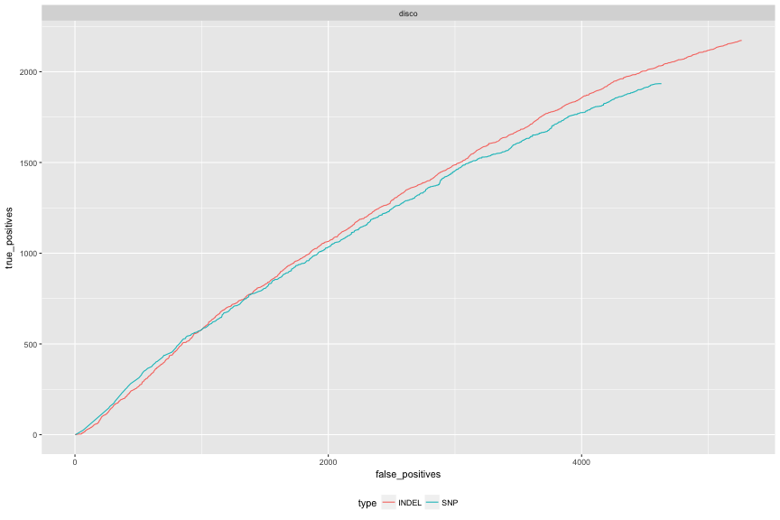
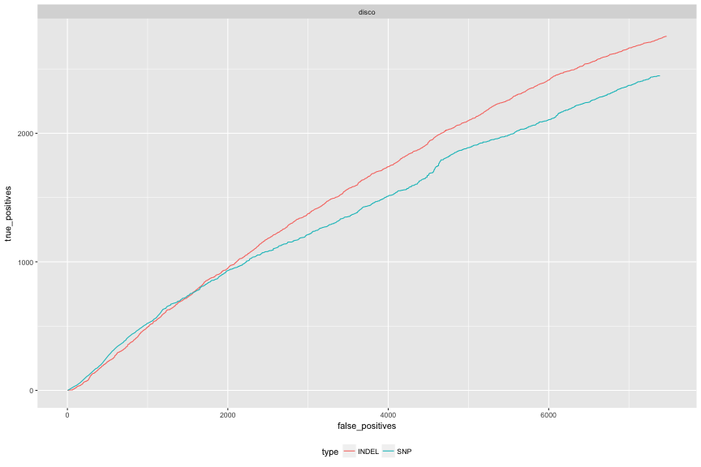

library(ggplot2)
library(hexbin)
library(reshape2)
library(knitr)

library(gridExtra)
library(grid)
library(ggplot2)
library(lattice)

```r
opts_chunk$set(fig.width=12, fig.height=8,dev=c('png','postscript'),warning=F)
```


```r
disco <- read.table("disco_3D7DD2.FILT.DD2-2D4_callable_disco_EVAL/weighted_roc.tsv.gz",header=F,skip = 3,stringsAsFactors =F,sep="\t",col.names=c("score","true_positives","false_positives","false_negatives","precision","sensitivity","f_measure"))
disco$caller="disco"
disco$region="GENOME"

discoSNPs <- read.table("disco_3D7DD2.FILT.DD2-2D4_callable_disco_EVAL/snp_roc.tsv.gz",header=F,skip = 3,stringsAsFactors =F,sep="\t",col.names = c("score","true_positives","false_positives"))
discoINDELs <- read.table("disco_3D7DD2.FILT.DD2-2D4_callable_disco_EVAL/non_snp_roc.tsv.gz",header=F,skip = 3,stringsAsFactors =F,sep="\t",col.names = c("score","true_positives","false_positives"))
discoSNPs$type="SNP"
discoINDELs$type="INDEL"
discoType <- rbind(discoSNPs,discoINDELs)
discoType$caller="disco"
discoType$region="GENOME"
posns <- intersect(discoSNPs$score,discoINDELs$score)
discoType <- subset(discoType,score %in% posns)


discoCALL <- read.table("disco_3D7DD2.FILT.DD2-2D4_callable_all_EVAL/weighted_roc.tsv.gz",header=F,skip = 3,stringsAsFactors =F,sep="\t",col.names=c("score","true_positives","false_positives","false_negatives","precision","sensitivity","f_measure"))
discoCALL$caller="disco"
discoCALL$region="CALLABLE"

discoCALLSNPs <- read.table("disco_3D7DD2.FILT.DD2-2D4_callable_all_EVAL/snp_roc.tsv.gz",header=F,skip = 3,stringsAsFactors =F,sep="\t",col.names = c("score","true_positives","false_positives"))
discoCALLINDELs <- read.table("disco_3D7DD2.FILT.DD2-2D4_callable_all_EVAL/non_snp_roc.tsv.gz",header=F,skip = 3,stringsAsFactors =F,sep="\t",col.names = c("score","true_positives","false_positives"))
discoCALLSNPs$type="SNP"
discoCALLINDELs$type="INDEL"
discoCALLType <- rbind(discoCALLSNPs,discoCALLINDELs)
discoCALLType$caller="disco"
discoCALLType$region="CALLABLE"
posns <- intersect(discoCALLSNPs$score,discoCALLINDELs$score)
discoCALLType <- subset(discoCALLType,score %in% posns)


head(disco); head(discoCALL)
```

```
##     score true_positives false_positives false_negatives precision
## 1 12716.5              0               1           11152         0
## 2 12440.6              0               2           11152         0
## 3 11888.1              0               3           11152         0
## 4 11019.3              0               5           11152         0
## 5 10182.2              0               6           11152         0
## 6 10132.9              0               8           11152         0
##   sensitivity f_measure caller region
## 1           0         0  disco GENOME
## 2           0         0  disco GENOME
## 3           0         0  disco GENOME
## 4           0         0  disco GENOME
## 5           0         0  disco GENOME
## 6           0         0  disco GENOME
```

```
##      score true_positives false_positives false_negatives precision
## 1 12716.50              0               1            8690         0
## 2 12440.60              0               2            8690         0
## 3 11888.10              0               3            8690         0
## 4 11019.30              0               5            8690         0
## 5 10182.20              0               6            8690         0
## 6  9100.44              0               7            8690         0
##   sensitivity f_measure caller   region
## 1           0         0  disco CALLABLE
## 2           0         0  disco CALLABLE
## 3           0         0  disco CALLABLE
## 4           0         0  disco CALLABLE
## 5           0         0  disco CALLABLE
## 6           0         0  disco CALLABLE
```

```r
head(discoType); head(discoCALLType)
```

```
##        score true_positives false_positives type caller region
## 4   11019.30              0               4  SNP  disco GENOME
## 111  3480.62             30              84  SNP  disco GENOME
## 148  3421.25             39             113  SNP  disco GENOME
## 211  3346.12             61             162  SNP  disco GENOME
## 243  3315.25             73             182  SNP  disco GENOME
## 327  3240.75            108             241  SNP  disco GENOME
```

```
##        score true_positives false_positives type caller   region
## 4   11019.30            0.0               4  SNP  disco CALLABLE
## 88   3480.62           25.0              65  SNP  disco CALLABLE
## 388  3123.62          147.0             267  SNP  disco CALLABLE
## 400  3113.25          155.5             275  SNP  disco CALLABLE
## 437  3088.50          169.5             300  SNP  disco CALLABLE
## 455  3078.00          177.5             312  SNP  disco CALLABLE
```

```r
# disco <- read.table("disco_3D7_0901_weighted_roc.tsv.gz",header=F,skip = 3,stringsAsFactors =F,sep="\t")
# colnames(disco) <-c("score","true_positives","false_positives","false_negatives","precision","sensitivity","f_measure")
# disco$sample="0901"
# disco$caller="disco"
# disco$filter=T
```


```r
gatk100 <- read.table("gatkHaplo_3D7DD2_100.VQSR.DD2-2D4_callable_haplo100_EVAL/weighted_roc.tsv.gz",header=F,skip = 3,stringsAsFactors =F,sep="\t",col.names=c("score","true_positives","false_positives","false_negatives","precision","sensitivity","f_measure"))
gatk100$caller="gatk100"
gatk100$region="GENOME"

gatk100SNPs <- read.table("gatkHaplo_3D7DD2_100.VQSR.DD2-2D4_callable_haplo100_EVAL/snp_roc.tsv.gz",header=F,skip = 3,stringsAsFactors =F,sep="\t",col.names = c("score","true_positives","false_positives"))
gatk100INDELs <- read.table("gatkHaplo_3D7DD2_100.VQSR.DD2-2D4_callable_haplo100_EVAL/non_snp_roc.tsv.gz",header=F,skip = 3,stringsAsFactors =F,sep="\t",col.names = c("score","true_positives","false_positives"))
gatk100SNPs$type="SNP"
gatk100INDELs$type="INDEL"
gatk100Type <- rbind(gatk100SNPs,gatk100INDELs)
gatk100Type$caller="gatk100"
gatk100Type$region="GENOME"
posns <- intersect(gatk100SNPs$score,gatk100INDELs$score)
gatk100Type <- subset(gatk100Type,score %in% posns)


gatkCALL100 <- read.table("gatkHaplo_3D7DD2_100.VQSR.DD2-2D4_callable_all_EVAL/weighted_roc.tsv.gz",header=F,skip = 3,stringsAsFactors =F,sep="\t",col.names=c("score","true_positives","false_positives","false_negatives","precision","sensitivity","f_measure"))
gatkCALL100$caller="gatk100"
gatkCALL100$region="CALLABLE"

gatkCALL100SNPs <- read.table("gatkHaplo_3D7DD2_100.VQSR.DD2-2D4_callable_all_EVAL/snp_roc.tsv.gz",header=F,skip = 3,stringsAsFactors =F,sep="\t",col.names = c("score","true_positives","false_positives"))
gatkCALL100INDELs <- read.table("gatkHaplo_3D7DD2_100.VQSR.DD2-2D4_callable_all_EVAL/non_snp_roc.tsv.gz",header=F,skip = 3,stringsAsFactors =F,sep="\t",col.names = c("score","true_positives","false_positives"))
gatkCALL100SNPs$type="SNP"
gatkCALL100INDELs$type="INDEL"
gatkCALL100Type <- rbind(gatkCALL100SNPs,gatkCALL100INDELs)
gatkCALL100Type$caller="gatk100"
gatkCALL100Type$region="CALLABLE"
posns <- intersect(gatkCALL100SNPs$score,gatkCALL100INDELs$score)
gatkCALL100Type <- subset(gatkCALL100Type,score %in% posns)
```


```r
gatk250 <- read.table("gatkHaplo_3D7DD2_250.VQSR.DD2-2D4_callable_haplo250_EVAL/weighted_roc.tsv.gz",header=F,skip = 3,stringsAsFactors =F,sep="\t",col.names=c("score","true_positives","false_positives","false_negatives","precision","sensitivity","f_measure"))
gatk250$caller="gatk250"
gatk250$region="GENOME"

gatk250SNPs <- read.table("gatkHaplo_3D7DD2_250.VQSR.DD2-2D4_callable_haplo250_EVAL/snp_roc.tsv.gz",header=F,skip = 3,stringsAsFactors =F,sep="\t",col.names = c("score","true_positives","false_positives"))
gatk250INDELs <- read.table("gatkHaplo_3D7DD2_250.VQSR.DD2-2D4_callable_haplo250_EVAL/non_snp_roc.tsv.gz",header=F,skip = 3,stringsAsFactors =F,sep="\t",col.names = c("score","true_positives","false_positives"))
gatk250SNPs$type="SNP"
gatk250INDELs$type="INDEL"
gatk250Type <- rbind(gatk250SNPs,gatk250INDELs)
gatk250Type$caller="gatk250"
gatk250Type$region="GENOME"
posns <- intersect(gatk250SNPs$score,gatk250INDELs$score)
gatk250Type <- subset(gatk250Type,score %in% posns)


gatkCALL250 <- read.table("gatkHaplo_3D7DD2_250.VQSR.DD2-2D4_callable_all_EVAL/weighted_roc.tsv.gz",header=F,skip = 3,stringsAsFactors =F,sep="\t",col.names=c("score","true_positives","false_positives","false_negatives","precision","sensitivity","f_measure"))
gatkCALL250$caller="gatk250"
gatkCALL250$region="CALLABLE"

gatkCALL250SNPs <- read.table("gatkHaplo_3D7DD2_250.VQSR.DD2-2D4_callable_all_EVAL/snp_roc.tsv.gz",header=F,skip = 3,stringsAsFactors =F,sep="\t",col.names = c("score","true_positives","false_positives"))
gatkCALL250INDELs <- read.table("gatkHaplo_3D7DD2_250.VQSR.DD2-2D4_callable_all_EVAL/non_snp_roc.tsv.gz",header=F,skip = 3,stringsAsFactors =F,sep="\t",col.names = c("score","true_positives","false_positives"))
gatkCALL250SNPs$type="SNP"
gatkCALL250INDELs$type="INDEL"
gatkCALL250Type <- rbind(gatkCALL250SNPs,gatkCALL250INDELs)
gatkCALL250Type$caller="gatk250"
gatkCALL250Type$region="CALLABLE"
posns <- intersect(gatkCALL250SNPs$score,gatkCALL250INDELs$score)
gatkCALL250Type <- subset(gatkCALL250Type,score %in% posns)
```


```r
rocCf <- rbind(discoCALLType,discoType,gatkCALL100Type,gatk100Type,gatkCALL250Type,gatk250Type)
```


```r
g_legend<-function(a.gplot){
  tmp <- ggplot_gtable(ggplot_build(a.gplot))
  leg <- which(sapply(tmp$grobs, function(x) x$name) == "guide-box")
  legend <- tmp$grobs[[leg]]
  return(legend)}
```


```r
#ROC PLOT
ggplot(discoCALLType,aes(x=false_positives,y=true_positives,colour=type)) + 
  geom_line() + facet_grid(. ~ caller) + theme(legend.position="bottom")
```



```r
# ggplot(discoType,aes(x=false_positives,y=true_positives,colour=type)) + 
#   geom_point() + facet_grid(. ~ caller) + theme(legend.position="bottom")


ggplot(discoType,aes(x=false_positives,y=true_positives,colour=type)) + 
  geom_line() + facet_grid(. ~ caller) + theme(legend.position="bottom")
```



```r
ggplot(rocCf,aes(x=false_positives,y=true_positives,colour=type,linetype=region)) + 
  geom_line() + facet_grid(. ~ caller) + theme(legend.position="bottom")
```


```r
ggplot(rocCf,aes(x=false_positives,y=true_positives,colour=type,linetype=region)) + 
  geom_line() + facet_grid(. ~ caller,scales = "free_x") + theme(legend.position="bottom")
```


```r
ggplot(rocCf,aes(x=false_positives,y=true_positives,colour=type,linetype=region)) + 
  geom_line() + scale_x_log10() + facet_grid(. ~ caller) + theme(legend.position="bottom")
```


```r
sumcols <- c("threshold","truepos","falsepos","falseneg","precision","sensitivity","F-measure")
discosum <- read.table("disco_3D7DD2.FILT.DD2-2D4_callable_disco_EVAL/summary.txt",skip=2,col.names = sumcols)
gatk100sum <- read.table("gatkHaplo_3D7DD2_100.VQSR.DD2-2D4_callable_haplo100_EVAL/summary.txt",skip=2,col.names = sumcols)
gatk250sum <- read.table("gatkHaplo_3D7DD2_250.VQSR.DD2-2D4_callable_haplo250_EVAL/summary.txt",skip=2,col.names = sumcols)

discosum$caller<-"disco"
gatk100sum$caller<-"gatk100"
gatk250sum$caller<-"gatk250"

callsums <- rbind(discosum,gatk250sum,gatk100sum)
#write.table(subset(callsums,threshold=="None"),sep="\t",quote=F,row.names = F)
subset(callsums,threshold=="None")
```

```
##   threshold truepos falsepos falseneg precision sensitivity F.measure
## 2      None    5204    14868     5948    0.2593      0.4666    0.3333
## 4      None    9446    40554     1575    0.1889      0.8571    0.3096
## 6      None    8056    28359     1199    0.2212      0.8704    0.3528
##    caller
## 2   disco
## 4 gatk250
## 6 gatk100
```

```r
subset(callsums,threshold!="None")
```

```
##   threshold truepos falsepos falseneg precision sensitivity F.measure
## 1   326.000    5074    14165     6078    0.2637      0.4550    0.3339
## 3 10131.900    7493    23560     3528    0.2413      0.6799    0.3562
## 5  4619.100    6837    19483     2418    0.2598      0.7387    0.3844
##    caller
## 1   disco
## 3 gatk250
## 5 gatk100
```
