```r
library(ggplot2)
library(hexbin)
library(reshape2)
library(knitr)

library(gridExtra)
library(grid)
library(ggplot2)
library(lattice)
#opts_chunk$set(fig.width=12, fig.height=8,dev=c('png','postscript'),warning=F)
opts_chunk$set(fig.width=12, fig.height=8,dev=c('png'),warning=F)
```


```r
rocf<-"disco_3D7DD2.FILT.DD2-2D4_callable_disco_LOD_EVAL"
disco <- read.table(paste(rocf,"weighted_roc.tsv.gz",sep="/"),header=F,skip = 3,stringsAsFactors =F,sep="\t",col.names=c("score","true_positives","false_positives","false_negatives","precision","sensitivity","f_measure"))
disco$caller="Disco"
disco$region="GENOME"

discoSNPs <- read.table(paste(rocf,"snp_roc.tsv.gz",sep="/"),header=F,skip = 3,stringsAsFactors =F,sep="\t",col.names = c("score","true_positives","false_positives"))
discoINDELs <- read.table(paste(rocf,"non_snp_roc.tsv.gz",sep="/"),header=F,skip = 3,stringsAsFactors =F,sep="\t",col.names = c("score","true_positives","false_positives"))
discoSNPs$type="SNP"
discoINDELs$type="INDEL"
discoType <- rbind(discoSNPs,discoINDELs)
discoType$caller="Disco"
discoType$region="GENOME"
# posns <- intersect(discoSNPs$score,discoINDELs$score)
# discoType <- subset(discoType,score %in% posns)


rocf<-"disco_3D7DD2.FILT.DD2-2D4_callable_all_LOD_EVAL"
discoCALL <- read.table(paste(rocf,"weighted_roc.tsv.gz",sep="/"),header=F,skip = 3,stringsAsFactors =F,sep="\t",col.names=c("score","true_positives","false_positives","false_negatives","precision","sensitivity","f_measure"))
discoCALL$caller="Disco"
discoCALL$region="CALLABLE"

discoCALLSNPs <- read.table(paste(rocf,"snp_roc.tsv.gz",sep="/"),header=F,skip = 3,stringsAsFactors =F,sep="\t",col.names = c("score","true_positives","false_positives"))
discoCALLINDELs <- read.table(paste(rocf,"non_snp_roc.tsv.gz",sep="/"),header=F,skip = 3,stringsAsFactors =F,sep="\t",col.names = c("score","true_positives","false_positives"))
discoCALLSNPs$type="SNP"
discoCALLINDELs$type="INDEL"
discoCALLType <- rbind(discoCALLSNPs,discoCALLINDELs)
discoCALLType$caller="Disco"
discoCALLType$region="CALLABLE"
# posns <- intersect(discoCALLSNPs$score,discoCALLINDELs$score)
# discoCALLType <- subset(discoCALLType,score %in% posns)


head(disco); head(discoCALL)
```

```
##    score true_positives false_positives false_negatives precision
## 1 13.710              0               1           17205    0.0000
## 2 13.700             14              23           17191    0.3784
## 3 13.690             25              44           17180    0.3623
## 4 13.680             37              58           17168    0.3895
## 5 13.670             47              68           17158    0.4087
## 6 13.660             57              82           17148    0.4101
##   sensitivity f_measure caller region
## 1      0.0000    0.0000  Disco GENOME
## 2      0.0008    0.0016  Disco GENOME
## 3      0.0015    0.0029  Disco GENOME
## 4      0.0022    0.0043  Disco GENOME
## 5      0.0027    0.0054  Disco GENOME
## 6      0.0033    0.0066  Disco GENOME
```

```
##    score true_positives false_positives false_negatives precision
## 1 13.710              0               1           12213    0.0000
## 2 13.700              9              20           12204    0.3103
## 3 13.690             17              36           12196    0.3208
## 4 13.680             27              48           12186    0.3600
## 5 13.670             36              56           12177    0.3913
## 6 13.660             44              68           12169    0.3929
##   sensitivity f_measure caller   region
## 1      0.0000    0.0000  Disco CALLABLE
## 2      0.0007    0.0015  Disco CALLABLE
## 3      0.0014    0.0028  Disco CALLABLE
## 4      0.0022    0.0044  Disco CALLABLE
## 5      0.0029    0.0059  Disco CALLABLE
## 6      0.0036    0.0071  Disco CALLABLE
```

```r
head(discoType); head(discoCALLType)
```

```
##   score true_positives false_positives type caller region
## 1 10.05              1               0  SNP  Disco GENOME
## 2 10.04              3               0  SNP  Disco GENOME
## 3 10.03              3               1  SNP  Disco GENOME
## 4 10.02              6               6  SNP  Disco GENOME
## 5 10.01              9               9  SNP  Disco GENOME
## 6 10.00             10              12  SNP  Disco GENOME
```

```
##   score true_positives false_positives type caller   region
## 1 10.04              1               0  SNP  Disco CALLABLE
## 2 10.03              1               1  SNP  Disco CALLABLE
## 3 10.02              4               4  SNP  Disco CALLABLE
## 4 10.01              6               5  SNP  Disco CALLABLE
## 5 10.00              7               7  SNP  Disco CALLABLE
## 6  9.99              9               7  SNP  Disco CALLABLE
```

```r
# disco <- read.table("disco_3D7_0901_weighted_roc.tsv.gz",header=F,skip = 3,stringsAsFactors =F,sep="\t")
# colnames(disco) <-c("score","true_positives","false_positives","false_negatives","precision","sensitivity","f_measure")
# disco$sample="0901"
# disco$caller="Disco"
# disco$filter=T
```


```r
rocf<-"gatkHaplo_3D7DD2_100.VQSR.DD2-2D4_callable_haplo100_LOD_EVAL"
gatk100 <- read.table(paste(rocf,"weighted_roc.tsv.gz",sep="/"),header=F,skip = 3,stringsAsFactors =F,sep="\t",col.names=c("score","true_positives","false_positives","false_negatives","precision","sensitivity","f_measure"))
gatk100$caller="Haplo100"
gatk100$region="GENOME"

gatk100SNPs <- read.table(paste(rocf,"snp_roc.tsv.gz",sep="/"),header=F,skip = 3,stringsAsFactors =F,sep="\t",col.names = c("score","true_positives","false_positives"))
gatk100INDELs <- read.table(paste(rocf,"non_snp_roc.tsv.gz",sep="/"),header=F,skip = 3,stringsAsFactors =F,sep="\t",col.names = c("score","true_positives","false_positives"))
gatk100SNPs$type="SNP"
gatk100INDELs$type="INDEL"
gatk100Type <- rbind(gatk100SNPs,gatk100INDELs)
gatk100Type$caller="Haplo100"
gatk100Type$region="GENOME"
# posns <- intersect(gatk100SNPs$score,gatk100INDELs$score)
# gatk100Type <- subset(gatk100Type,score %in% posns)


rocf<-"gatkHaplo_3D7DD2_100.VQSR.DD2-2D4_callable_all_LOD_EVAL"
gatkCALL100 <- read.table(paste(rocf,"weighted_roc.tsv.gz",sep="/"),header=F,skip = 3,stringsAsFactors =F,sep="\t",col.names=c("score","true_positives","false_positives","false_negatives","precision","sensitivity","f_measure"))
gatkCALL100$caller="Haplo100"
gatkCALL100$region="CALLABLE"

gatkCALL100SNPs <- read.table(paste(rocf,"snp_roc.tsv.gz",sep="/"),header=F,skip = 3,stringsAsFactors =F,sep="\t",col.names = c("score","true_positives","false_positives"))
gatkCALL100INDELs <- read.table(paste(rocf,"non_snp_roc.tsv.gz",sep="/"),header=F,skip = 3,stringsAsFactors =F,sep="\t",col.names = c("score","true_positives","false_positives"))
gatkCALL100SNPs$type="SNP"
gatkCALL100INDELs$type="INDEL"
gatkCALL100Type <- rbind(gatkCALL100SNPs,gatkCALL100INDELs)
gatkCALL100Type$caller="Haplo100"
gatkCALL100Type$region="CALLABLE"
# posns <- intersect(gatkCALL100SNPs$score,gatkCALL100INDELs$score)
# gatkCALL100Type <- subset(gatkCALL100Type,score %in% posns)
```


```r
rocf<-"gatkHaplo_3D7DD2_250.VQSR.DD2-2D4_callable_haplo250_LOD_EVAL"
gatk250 <- read.table(paste(rocf,"weighted_roc.tsv.gz",sep="/"),header=F,skip = 3,stringsAsFactors =F,sep="\t",col.names=c("score","true_positives","false_positives","false_negatives","precision","sensitivity","f_measure"))
gatk250$caller="Haplo250"
gatk250$region="GENOME"

gatk250SNPs <- read.table(paste(rocf,"snp_roc.tsv.gz",sep="/"),header=F,skip = 3,stringsAsFactors =F,sep="\t",col.names = c("score","true_positives","false_positives"))
gatk250INDELs <- read.table(paste(rocf,"non_snp_roc.tsv.gz",sep="/"),header=F,skip = 3,stringsAsFactors =F,sep="\t",col.names = c("score","true_positives","false_positives"))
gatk250SNPs$type="SNP"
gatk250INDELs$type="INDEL"
gatk250Type <- rbind(gatk250SNPs,gatk250INDELs)
gatk250Type$caller="Haplo250"
gatk250Type$region="GENOME"
# posns <- intersect(gatk250SNPs$score,gatk250INDELs$score)
# gatk250Type <- subset(gatk250Type,score %in% posns)

rocf<-"gatkHaplo_3D7DD2_250.VQSR.DD2-2D4_callable_all_LOD_EVAL"
gatkCALL250 <- read.table(paste(rocf,"weighted_roc.tsv.gz",sep="/"),header=F,skip = 3,stringsAsFactors =F,sep="\t",col.names=c("score","true_positives","false_positives","false_negatives","precision","sensitivity","f_measure"))
gatkCALL250$caller="Haplo250"
gatkCALL250$region="CALLABLE"

gatkCALL250SNPs <- read.table(paste(rocf,"snp_roc.tsv.gz",sep="/"),header=F,skip = 3,stringsAsFactors =F,sep="\t",col.names = c("score","true_positives","false_positives"))
gatkCALL250INDELs <- read.table(paste(rocf,"non_snp_roc.tsv.gz",sep="/"),header=F,skip = 3,stringsAsFactors =F,sep="\t",col.names = c("score","true_positives","false_positives"))
gatkCALL250SNPs$type="SNP"
gatkCALL250INDELs$type="INDEL"
gatkCALL250Type <- rbind(gatkCALL250SNPs,gatkCALL250INDELs)
gatkCALL250Type$caller="Haplo250"
gatkCALL250Type$region="CALLABLE"
# posns <- intersect(gatkCALL250SNPs$score,gatkCALL250INDELs$score)
# gatkCALL250Type <- subset(gatkCALL250Type,score %in% posns)
```


```r
rocf<-"disco_3D7DD2.FILT.DD2-2D4_callable_disco_LOD_FILT_EVAL"
disco <- read.table(paste(rocf,"weighted_roc.tsv.gz",sep="/"),header=F,skip = 3,stringsAsFactors =F,sep="\t",col.names=c("score","true_positives","false_positives","false_negatives","precision","sensitivity","f_measure"))
disco$caller="Disco"
disco$region="GENOME"

discoSNPs <- read.table(paste(rocf,"snp_roc.tsv.gz",sep="/"),header=F,skip = 3,stringsAsFactors =F,sep="\t",col.names = c("score","true_positives","false_positives"))
discoINDELs <- read.table(paste(rocf,"non_snp_roc.tsv.gz",sep="/"),header=F,skip = 3,stringsAsFactors =F,sep="\t",col.names = c("score","true_positives","false_positives"))
discoSNPs$type="SNP"
discoINDELs$type="INDEL"
discoFiltType <- rbind(discoSNPs,discoINDELs)
discoFiltType$caller="Disco"
discoFiltType$region="GENOME"
# posns <- intersect(discoSNPs$score,discoINDELs$score)
# discoFiltType <- subset(discoFiltType,score %in% posns)


rocf<-"disco_3D7DD2.FILT.DD2-2D4_callable_all_LOD_FILT_EVAL"
discoCALL <- read.table(paste(rocf,"weighted_roc.tsv.gz",sep="/"),header=F,skip = 3,stringsAsFactors =F,sep="\t",col.names=c("score","true_positives","false_positives","false_negatives","precision","sensitivity","f_measure"))
discoCALL$caller="Disco"
discoCALL$region="CALLABLE"

discoCALLSNPs <- read.table(paste(rocf,"snp_roc.tsv.gz",sep="/"),header=F,skip = 3,stringsAsFactors =F,sep="\t",col.names = c("score","true_positives","false_positives"))
discoCALLINDELs <- read.table(paste(rocf,"non_snp_roc.tsv.gz",sep="/"),header=F,skip = 3,stringsAsFactors =F,sep="\t",col.names = c("score","true_positives","false_positives"))
discoCALLSNPs$type="SNP"
discoCALLINDELs$type="INDEL"
discoCALLFiltType <- rbind(discoCALLSNPs,discoCALLINDELs)
discoCALLFiltType$caller="Disco"
discoCALLFiltType$region="CALLABLE"
# posns <- intersect(discoCALLSNPs$score,discoCALLINDELs$score)
# discoCALLFiltType <- subset(discoCALLFiltType,score %in% posns)


head(disco); head(discoCALL)
```

```
##    score true_positives false_positives false_negatives precision
## 1 13.700             14               1           17191    0.9333
## 2 13.690             24               1           17181    0.9600
## 3 13.680             36               1           17169    0.9730
## 4 13.670             46               1           17159    0.9787
## 5 13.660             56               2           17149    0.9655
## 6 13.650             74               2           17131    0.9737
##   sensitivity f_measure caller region
## 1      0.0008    0.0016  Disco GENOME
## 2      0.0014    0.0028  Disco GENOME
## 3      0.0021    0.0042  Disco GENOME
## 4      0.0027    0.0053  Disco GENOME
## 5      0.0033    0.0065  Disco GENOME
## 6      0.0043    0.0086  Disco GENOME
```

```
##    score true_positives false_positives false_negatives precision
## 1 13.700              9               0           12204    1.0000
## 2 13.690             16               0           12197    1.0000
## 3 13.680             26               0           12187    1.0000
## 4 13.670             35               0           12178    1.0000
## 5 13.660             43               1           12170    0.9773
## 6 13.650             58               1           12155    0.9831
##   sensitivity f_measure caller   region
## 1      0.0007    0.0015  Disco CALLABLE
## 2      0.0013    0.0026  Disco CALLABLE
## 3      0.0021    0.0042  Disco CALLABLE
## 4      0.0029    0.0057  Disco CALLABLE
## 5      0.0035    0.0070  Disco CALLABLE
## 6      0.0047    0.0095  Disco CALLABLE
```

```r
head(discoFiltType); head(discoCALLFiltType)
```

```
##   score true_positives false_positives type caller region
## 1 10.05              1               0  SNP  Disco GENOME
## 2 10.04              3               0  SNP  Disco GENOME
## 3 10.02              6               0  SNP  Disco GENOME
## 4 10.01              9               0  SNP  Disco GENOME
## 5 10.00             10               0  SNP  Disco GENOME
## 6  9.99             12               0  SNP  Disco GENOME
```

```
##   score true_positives false_positives type caller   region
## 1 10.04              1               0  SNP  Disco CALLABLE
## 2 10.02              4               0  SNP  Disco CALLABLE
## 3 10.01              6               0  SNP  Disco CALLABLE
## 4 10.00              7               0  SNP  Disco CALLABLE
## 5  9.99              9               0  SNP  Disco CALLABLE
## 6  9.98             11               0  SNP  Disco CALLABLE
```

```r
# disco <- read.table("disco_3D7_0901_weighted_roc.tsv.gz",header=F,skip = 3,stringsAsFactors =F,sep="\t")
# colnames(disco) <-c("score","true_positives","false_positives","false_negatives","precision","sensitivity","f_measure")
# disco$sample="0901"
# disco$caller="Disco"
# disco$filter=T
```


```r
#rocf<-"gatkHaplo_3D7DD2_100.VQSR.DD2-2D4_callable_haplo100_LOD_FILT_EVAL"
rocf<-"gatkHaplo_3D7DD2_100.VQSR90.DD2-2D4.nr_callable_haplo100_LOD_FILT_EVAL"

gatk100 <- read.table(paste(rocf,"weighted_roc.tsv.gz",sep="/"),header=F,skip = 3,stringsAsFactors =F,sep="\t",col.names=c("score","true_positives","false_positives","false_negatives","precision","sensitivity","f_measure"))
gatk100$caller="Haplo100"
gatk100$region="GENOME"

gatk100SNPs <- read.table(paste(rocf,"snp_roc.tsv.gz",sep="/"),header=F,skip = 3,stringsAsFactors =F,sep="\t",col.names = c("score","true_positives","false_positives"))
gatk100INDELs <- read.table(paste(rocf,"non_snp_roc.tsv.gz",sep="/"),header=F,skip = 3,stringsAsFactors =F,sep="\t",col.names = c("score","true_positives","false_positives"))
gatk100SNPs$type="SNP"
gatk100INDELs$type="INDEL"
gatk100FiltType <- rbind(gatk100SNPs,gatk100INDELs)
gatk100FiltType$caller="Haplo100"
gatk100FiltType$region="GENOME"
# posns <- intersect(gatk100SNPs$score,gatk100INDELs$score)
# gatk100FiltType <- subset(gatk100FiltType,score %in% posns)


#rocf<-"gatkHaplo_3D7DD2_100.VQSR.DD2-2D4_callable_all_LOD_FILT_EVAL"
rocf<-"gatkHaplo_3D7DD2_100.VQSR90.DD2-2D4.nr_callable_all_LOD_FILT_EVAL"
gatkCALL100 <- read.table(paste(rocf,"weighted_roc.tsv.gz",sep="/"),header=F,skip = 3,stringsAsFactors =F,sep="\t",col.names=c("score","true_positives","false_positives","false_negatives","precision","sensitivity","f_measure"))
gatkCALL100$caller="Haplo100"
gatkCALL100$region="CALLABLE"

gatkCALL100SNPs <- read.table(paste(rocf,"snp_roc.tsv.gz",sep="/"),header=F,skip = 3,stringsAsFactors =F,sep="\t",col.names = c("score","true_positives","false_positives"))
gatkCALL100INDELs <- read.table(paste(rocf,"non_snp_roc.tsv.gz",sep="/"),header=F,skip = 3,stringsAsFactors =F,sep="\t",col.names = c("score","true_positives","false_positives"))
gatkCALL100SNPs$type="SNP"
gatkCALL100INDELs$type="INDEL"
gatkCALL100FiltType <- rbind(gatkCALL100SNPs,gatkCALL100INDELs)
gatkCALL100FiltType$caller="Haplo100"
gatkCALL100FiltType$region="CALLABLE"
# posns <- intersect(gatkCALL100SNPs$score,gatkCALL100INDELs$score)
# gatkCALL100FiltType <- subset(gatkCALL100FiltType,score %in% posns)
```


```r
#rocf<-"gatkHaplo_3D7DD2_250.VQSR.DD2-2D4_callable_haplo250_LOD_FILT_EVAL"
rocf<-"gatkHaplo_3D7DD2_250.VQSR90.DD2-2D4.nr_callable_haplo250_LOD_FILT_EVAL"

gatk250 <- read.table(paste(rocf,"weighted_roc.tsv.gz",sep="/"),header=F,skip = 3,stringsAsFactors =F,sep="\t",col.names=c("score","true_positives","false_positives","false_negatives","precision","sensitivity","f_measure"))
gatk250$caller="Haplo250"
gatk250$region="GENOME"

gatk250SNPs <- read.table(paste(rocf,"snp_roc.tsv.gz",sep="/"),header=F,skip = 3,stringsAsFactors =F,sep="\t",col.names = c("score","true_positives","false_positives"))
gatk250INDELs <- read.table(paste(rocf,"non_snp_roc.tsv.gz",sep="/"),header=F,skip = 3,stringsAsFactors =F,sep="\t",col.names = c("score","true_positives","false_positives"))
gatk250SNPs$type="SNP"
gatk250INDELs$type="INDEL"
gatk250FiltType <- rbind(gatk250SNPs,gatk250INDELs)
gatk250FiltType$caller="Haplo250"
gatk250FiltType$region="GENOME"
# posns <- intersect(gatk250SNPs$score,gatk250INDELs$score)
# gatk250FiltType <- subset(gatk250FiltType,score %in% posns)

#rocf<-"gatkHaplo_3D7DD2_250.VQSR.DD2-2D4_callable_all_LOD_FILT_EVAL"
rocf<-"gatkHaplo_3D7DD2_250.VQSR90.DD2-2D4.nr_callable_all_LOD_FILT_EVAL"

gatkCALL250 <- read.table(paste(rocf,"weighted_roc.tsv.gz",sep="/"),header=F,skip = 3,stringsAsFactors =F,sep="\t",col.names=c("score","true_positives","false_positives","false_negatives","precision","sensitivity","f_measure"))
gatkCALL250$caller="Haplo250"
gatkCALL250$region="CALLABLE"

gatkCALL250SNPs <- read.table(paste(rocf,"snp_roc.tsv.gz",sep="/"),header=F,skip = 3,stringsAsFactors =F,sep="\t",col.names = c("score","true_positives","false_positives"))
gatkCALL250INDELs <- read.table(paste(rocf,"non_snp_roc.tsv.gz",sep="/"),header=F,skip = 3,stringsAsFactors =F,sep="\t",col.names = c("score","true_positives","false_positives"))
gatkCALL250SNPs$type="SNP"
gatkCALL250INDELs$type="INDEL"
gatkCALL250FiltType <- rbind(gatkCALL250SNPs,gatkCALL250INDELs)
gatkCALL250FiltType$caller="Haplo250"
gatkCALL250FiltType$region="CALLABLE"
# posns <- intersect(gatkCALL250SNPs$score,gatkCALL250INDELs$score)
# gatkCALL250FiltType <- subset(gatkCALL250FiltType,score %in% posns)
```


```r
rocCf <- rbind(discoCALLType,discoType,gatkCALL100Type,gatk100Type,gatkCALL250Type,gatk250Type)
rocFiltCf <- rbind(discoCALLFiltType,discoFiltType,gatkCALL100FiltType,gatk100FiltType,gatkCALL250FiltType,gatk250FiltType)

rocCf$filtered=F
rocFiltCf$filtered=T

rocCfALL <- rbind(rocCf,rocFiltCf)
rocCfALL$caller <- factor(rocCfALL$caller,levels=c("Disco","Haplo250","Haplo100"),ordered=T)
```


```r
g_legend<-function(a.gplot){
  tmp <- ggplot_gtable(ggplot_build(a.gplot))
  leg <- which(sapply(tmp$grobs, function(x) x$name) == "guide-box")
  legend <- tmp$grobs[[leg]]
  return(legend)}
```


```r
#ROC PLOT

ggplot(discoCALLType,aes(x=false_positives,y=true_positives,colour=type)) + 
  geom_line() + facet_grid(. ~ caller) + theme(legend.position="bottom") + ggtitle("discovar ROC, all-callable genome")
```


```r
ggplot(discoType,aes(x=false_positives,y=true_positives,colour=type)) + 
  geom_line() + facet_grid(. ~ caller) + theme(legend.position="bottom") + ggtitle("discovar ROC, discovar-callable genome")
```

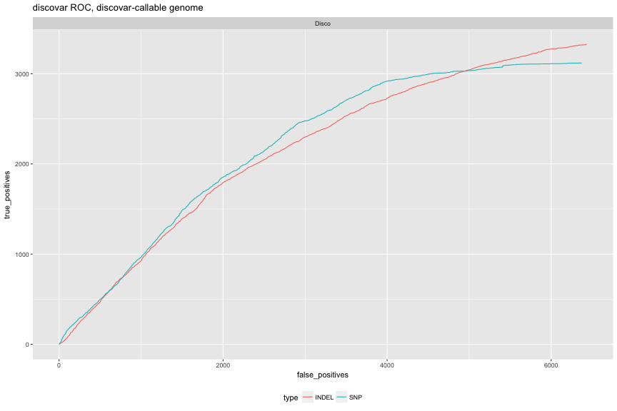

```r
ggplot(rocCf,aes(x=false_positives,y=true_positives,colour=type,linetype=region)) + 
  geom_line() + facet_grid(. ~ caller) + theme(legend.position="bottom") + ggtitle("ROC plots, core/callable")
```

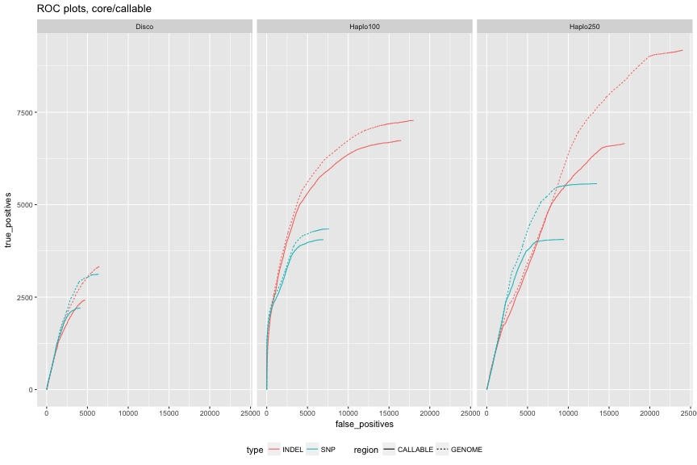

```r
ggplot(rocCf,aes(x=false_positives,y=true_positives,colour=type,linetype=region)) + 
  geom_line() + facet_grid(. ~ caller,scales = "free_x") + theme(legend.position="bottom") + ggtitle("ROC plots, core/callable, free-X")
```

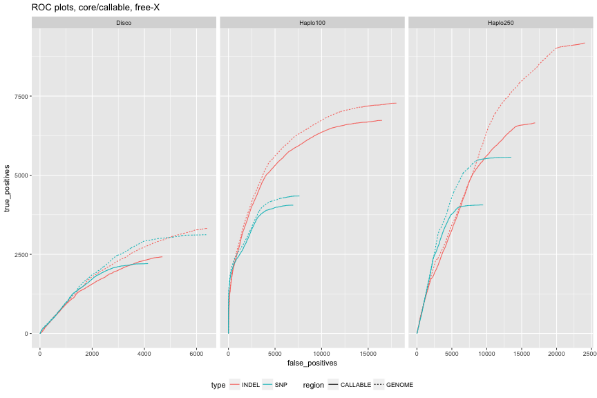


```r
#ROC PLOT

ggplot(discoCALLFiltType,aes(x=false_positives,y=true_positives,colour=type)) + 
  geom_line() + facet_grid(. ~ caller) + theme(legend.position="bottom") + ggtitle("discovar ROC, all-callable genome")
```

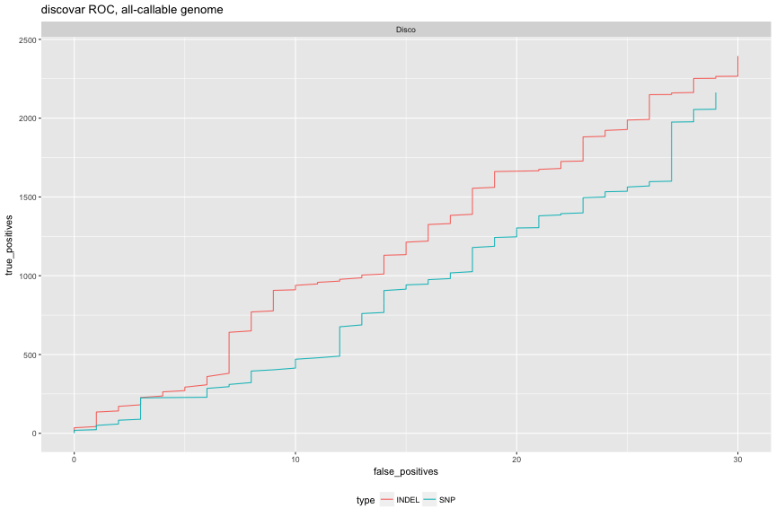

```r
ggplot(discoFiltType,aes(x=false_positives,y=true_positives,colour=type)) + 
  geom_line() + facet_grid(. ~ caller) + theme(legend.position="bottom") + ggtitle("discovar ROC, discovar-callable genome")
```

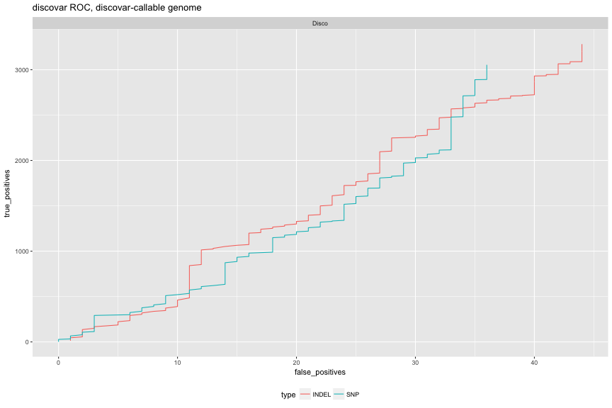

```r
ggplot(rocFiltCf,aes(x=false_positives,y=true_positives,colour=type,linetype=region)) + 
  geom_line() + facet_grid(. ~ caller) + theme(legend.position="bottom") + ggtitle("ROC plots, core/callable")
```

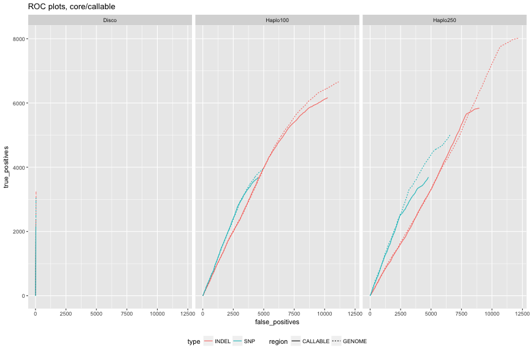

```r
ggplot(rocFiltCf,aes(x=false_positives,y=true_positives,colour=type,linetype=region)) + 
  geom_line() + facet_grid(. ~ caller,scales = "free_x") + theme(legend.position="bottom") + ggtitle("ROC plots, core/callable, free-X")
```

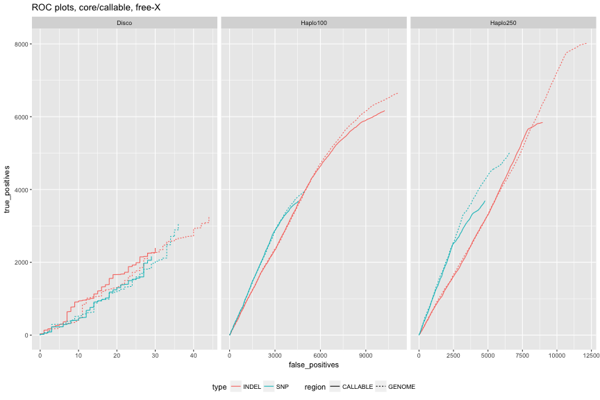


```r
sumcols <- c("threshold","truepos","falsepos","falseneg","precision","sensitivity","F-measure")
discosum <- read.table("disco_3D7DD2.FILT.DD2-2D4_callable_disco_LOD_EVAL/summary.txt",skip=2,col.names = sumcols)
gatk100sum <- read.table("gatkHaplo_3D7DD2_100.VQSR.DD2-2D4_callable_haplo100_LOD_EVAL/summary.txt",skip=2,col.names = sumcols)
gatk250sum <- read.table("gatkHaplo_3D7DD2_250.VQSR.DD2-2D4_callable_haplo250_LOD_EVAL/summary.txt",skip=2,col.names = sumcols)

discosum$caller<-"Disco"
gatk100sum$caller<-"Haplo100"
gatk250sum$caller<-"Haplo250"
discosum$filtered<-F
gatk100sum$filtered<-F
gatk250sum$filtered<-F

discosumF <- read.table("disco_3D7DD2.FILT.DD2-2D4_callable_disco_LOD_FILT_EVAL/summary.txt",skip=2,col.names = sumcols)
gatk100sumF <- read.table("gatkHaplo_3D7DD2_100.VQSR.DD2-2D4_callable_haplo100_LOD_FILT_EVAL/summary.txt",skip=2,col.names = sumcols)
gatk250sumF <- read.table("gatkHaplo_3D7DD2_250.VQSR.DD2-2D4_callable_haplo250_LOD_FILT_EVAL/summary.txt",skip=2,col.names = sumcols)

discosumF$caller<-"Disco"
gatk100sumF$caller<-"Haplo100"
gatk250sumF$caller<-"Haplo250"
discosumF$filtered<-T
gatk100sumF$filtered<-T
gatk250sumF$filtered<-T

callsumsCf <- rbind(discosum,gatk250sum,gatk100sum,
                    discosumF,gatk250sumF,gatk100sumF)
callsumsCf$region="core+extended"
callsumsCfThr <- subset(callsumsCf,threshold!="None" & filtered==F)
callsumsCf <- subset(callsumsCf,threshold=="None")
callsumsCf$caller <- factor(callsumsCf$caller,levels=c("Disco","Haplo250","Haplo100"),ordered=T)
callsumsCf
```

```
##    threshold truepos falsepos falseneg precision sensitivity F.measure
## 2       None    6660    13399    10545    0.3320      0.3871    0.3574
## 4       None   14746    37559     2352    0.2819      0.8624    0.4249
## 6       None   11618    25647     1661    0.3118      0.8749    0.4597
## 8       None    6549       84    10656    0.9873      0.3806    0.5495
## 10      None   14619    32406     2479    0.3109      0.8550    0.4560
## 12      None   11561    23259     1718    0.3320      0.8706    0.4807
##      caller filtered        region
## 2     Disco    FALSE core+extended
## 4  Haplo250    FALSE core+extended
## 6  Haplo100    FALSE core+extended
## 8     Disco     TRUE core+extended
## 10 Haplo250     TRUE core+extended
## 12 Haplo100     TRUE core+extended
```


```r
discosumCore <- read.table("disco_3D7DD2.FILT.DD2-2D4_callable_all_LOD_FILT_EVAL/summary.txt",skip=2,col.names = sumcols)
gatk100sumCore <- read.table("gatkHaplo_3D7DD2_100.VQSR.DD2-2D4_callable_all_LOD_FILT_EVAL/summary.txt",skip=2,col.names = sumcols)
gatk250sumCore <- read.table("gatkHaplo_3D7DD2_250.VQSR.DD2-2D4_callable_all_LOD_FILT_EVAL/summary.txt",skip=2,col.names = sumcols)

discosumCore$caller<-"Disco"
gatk100sumCore$caller<-"Haplo100"
gatk250sumCore$caller<-"Haplo250"
discosumCore$filtered<-T
gatk100sumCore$filtered<-T
gatk250sumCore$filtered<-T


discosumCoreF <- read.table("disco_3D7DD2.FILT.DD2-2D4_callable_all_LOD_EVAL/summary.txt",skip=2,col.names = sumcols)
gatk100sumCoreF <- read.table("gatkHaplo_3D7DD2_100.VQSR.DD2-2D4_callable_all_LOD_EVAL/summary.txt",skip=2,col.names = sumcols)
gatk250sumCoreF <- read.table("gatkHaplo_3D7DD2_250.VQSR.DD2-2D4_callable_all_LOD_EVAL/summary.txt",skip=2,col.names = sumcols)

discosumCoreF$caller<-"Disco"
gatk100sumCoreF$caller<-"Haplo100"
gatk250sumCoreF$caller<-"Haplo250"
discosumCoreF$filtered<-F
gatk100sumCoreF$filtered<-F
gatk250sumCoreF$filtered<-F


callsumsCoreCf <- rbind(discosumCore,gatk250sumCore,gatk100sumCore,
                          discosumCoreF,gatk250sumCoreF,gatk100sumCoreF)
callsumsCoreCf$region="core"
callsumsCoreCf<-subset(callsumsCoreCf,threshold=="None")
callsumsCoreCf$caller <- factor(callsumsCoreCf$caller,levels=c("Disco","Haplo250","Haplo100"),ordered=T)

callsumsCoreCf
```

```
##    threshold truepos falsepos falseneg precision sensitivity F.measure
## 2       None    4705       62     7508    0.9870      0.3852    0.5542
## 4       None   10636    22841     1577    0.3177      0.8709    0.4656
## 6       None   10731    21312     1482    0.3349      0.8787    0.4850
## 8       None    4776     9227     7437    0.3411      0.3911    0.3644
## 10      None   10712    26404     1501    0.2886      0.8771    0.4343
## 12      None   10783    23434     1430    0.3151      0.8829    0.4645
##      caller filtered region
## 2     Disco     TRUE   core
## 4  Haplo250     TRUE   core
## 6  Haplo100     TRUE   core
## 8     Disco    FALSE   core
## 10 Haplo250    FALSE   core
## 12 Haplo100    FALSE   core
```


```r
opts_chunk$set(fig.width=12, fig.height=8,dev=c('png','postscript'),warning=F)
#opts_chunk$set(fig.width=12, fig.height=8,dev=c('png'),warning=F)
```


```r
ggplot(rocCfALL,aes(x=false_positives,y=true_positives,colour=type,linetype=region)) + geom_line() + 
  geom_text(data=callsumsCf,aes(x=2000,y=8000,label=paste("prec:",precision,"\nsens:",sensitivity)),inherit.aes = F,hjust=0)+
  facet_grid(filtered ~ caller) + theme(legend.position="bottom") + ggtitle("ROC plots, core/extended genome")
```

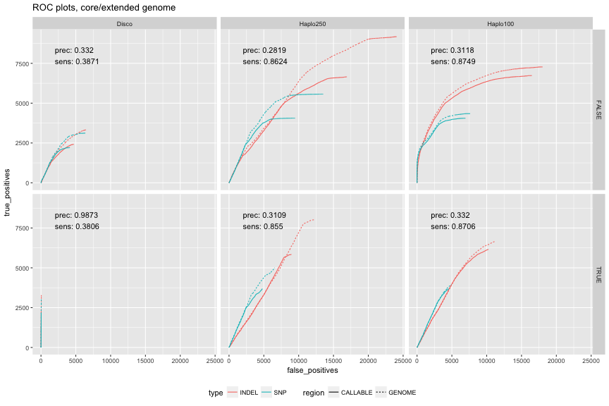

```r
ggplot(rocCfALL,aes(x=false_positives,y=true_positives,colour=type,linetype=region)) + geom_line() + 
  geom_text(data=callsumsCf,aes(x=2000,y=8000,label=paste("prec:",precision,"\nsens:",sensitivity)),inherit.aes = F,hjust=0)+
  facet_grid(filtered ~ caller,scales = "free_x") + theme(legend.position="bottom") + ggtitle("ROC plots, core/callable, free-X")
```

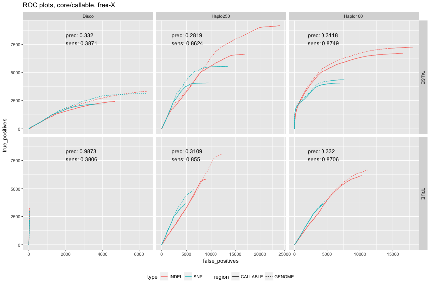

```r
ggplot(subset(rocCfALL,filtered==F),aes(x=false_positives,y=true_positives,colour=type,linetype=region)) + geom_line(size=1) + 
  geom_text(data=subset(callsumsCf,filtered==F),aes(x=2000,y=7500,label=paste("prec:",precision,"\nsens:",sensitivity)),inherit.aes = F,hjust=0)+
  facet_grid(. ~ caller) + theme(legend.position="bottom") + ggtitle("ROC plots, core/extended genome, no filter")
```

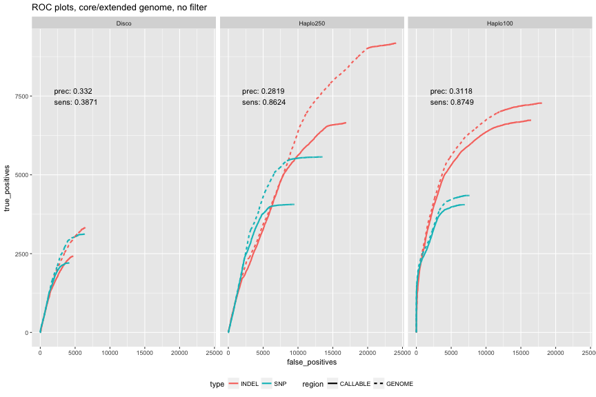

```r
thrs <- as.numeric(as.character(callsumsCfThr$threshold))
names(thrs) <- as.character(callsumsCfThr$caller)


rocCfALLThrPass <- rocCfALL[((rocCfALL$caller=="Disco" & rocCfALL$score>=thrs["Disco"]) | 
                        (rocCfALL$caller=="Haplo250" & rocCfALL$score>=thrs["Haplo250"]) |
                        (rocCfALL$caller=="Haplo100" & rocCfALL$score>=thrs["Haplo100"])) &
                        rocCfALL$filtered==F,]
rocCfALLThrFail <- rocCfALL[((rocCfALL$caller=="Disco" & rocCfALL$score<thrs["Disco"]) | 
                        (rocCfALL$caller=="Haplo250" & rocCfALL$score<thrs["Haplo250"]) |
                        (rocCfALL$caller=="Haplo100" & rocCfALL$score<thrs["Haplo100"])) &
                        rocCfALL$filtered==F,]


ggplot(rocCfALLThrPass,aes(x=false_positives,y=true_positives,colour=type,linetype=region)) +
  geom_line(data=subset(rocCfALLThrFail,type=="INDEL"),aes(x=false_positives,y=true_positives),colour="grey",size=1) +
  geom_line(data=subset(rocCfALLThrFail,type=="SNP"),aes(x=false_positives,y=true_positives),colour="grey",size=1) +
  geom_line(size=1) +
  geom_text(data=subset(callsumsCf,filtered==F),aes(x=1000,y=7500,label=paste("prec:",precision,"\nsens:",sensitivity)),inherit.aes = F,hjust=0)+
  facet_grid(. ~ caller) + theme(legend.position="bottom") + ggtitle("ROC plots, core/extended genome, threshold")
```

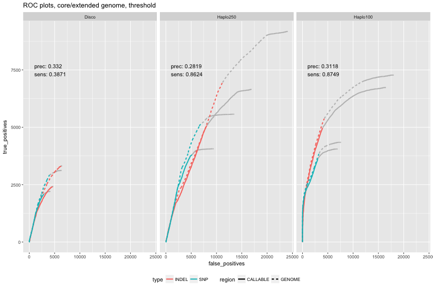

