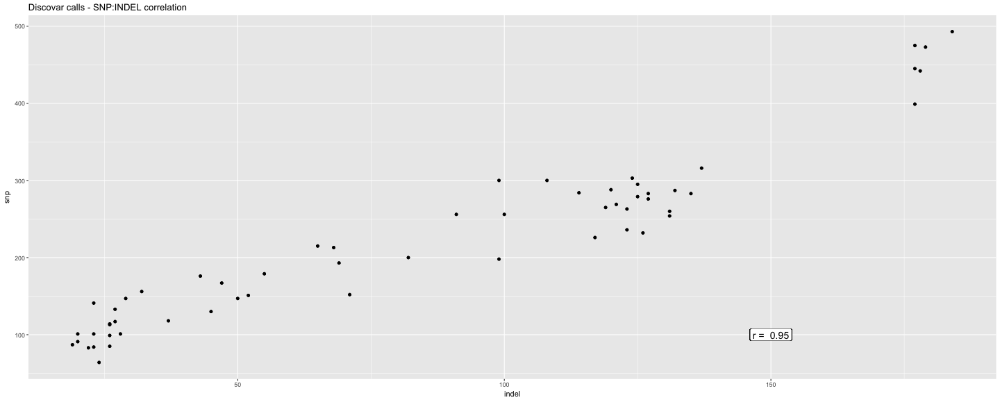
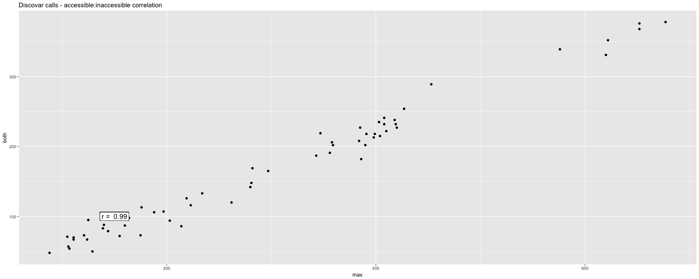
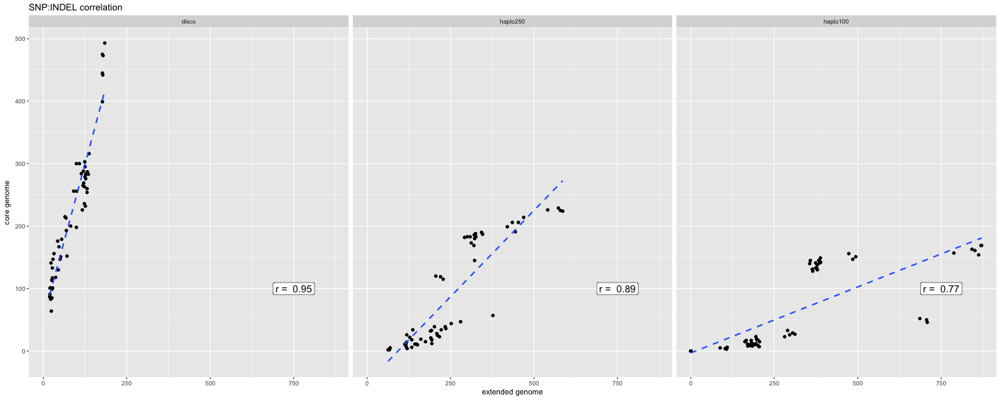
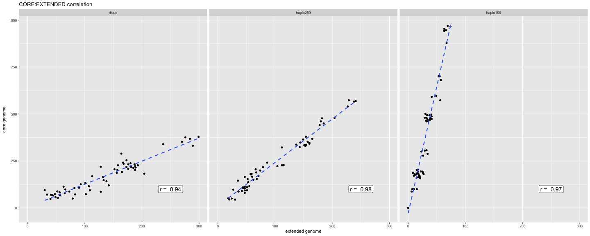
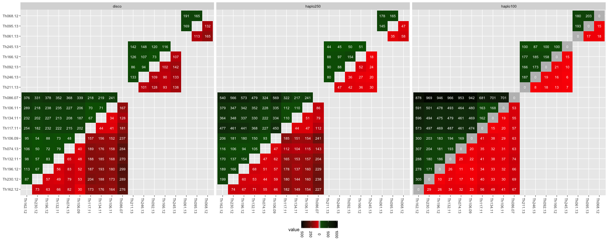
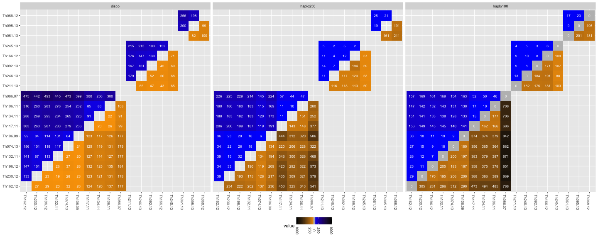
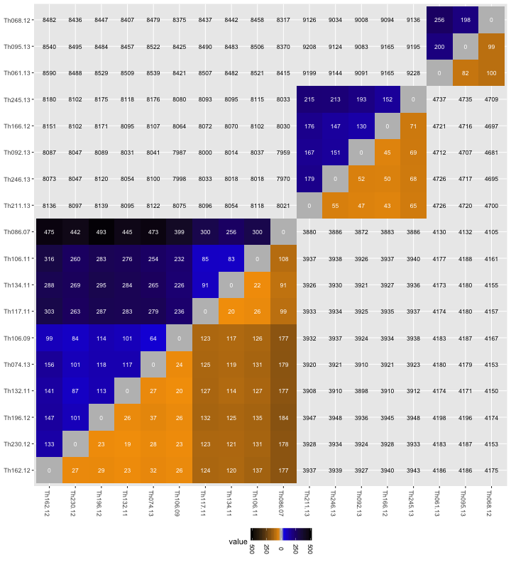

```r
library(ggplot2)
library(hexbin)
library(reshape2)
library(knitr)

library(gridExtra)
library(grid)
library(ggplot2)
library(lattice)
opts_chunk$set(fig.width=20, fig.height=8,dev=c('png','postscript'),warning=F)
#opts_chunk$set(fig.width=20, fig.height=8,dev=c('png'),warning=F)
```


```r
g_legend<-function(a.gplot){
  tmp <- ggplot_gtable(ggplot_build(a.gplot))
  leg <- which(sapply(tmp$grobs, function(x) x$name) == "guide-box")
  legend <- tmp$grobs[[leg]]
  return(legend)}

reflect<-function(mat){
  mat[lower.tri(mat)] <- t(mat)[lower.tri(mat)]
  return(mat)
  }

tree_order <- c(
  "Th162.12", "Th230.12","Th196.12","Th132.11", "Th074.13", "Th106.09", "Th117.11", "Th134.11", "Th106.11","Th086.07",   
  "Th211.13","Th246.13", "Th092.13","Th166.12", "Th245.13", 
  "Th061.13", "Th095.13", "Th068.12"
)
clades <- c(
  rep(3,10),
  rep(2,5),
  rep(1,3))
names(clades)<-tree_order
clades
```

```
## Th162.12 Th230.12 Th196.12 Th132.11 Th074.13 Th106.09 Th117.11 Th134.11 
##        3        3        3        3        3        3        3        3 
## Th106.11 Th086.07 Th211.13 Th246.13 Th092.13 Th166.12 Th245.13 Th061.13 
##        3        3        2        2        2        2        2        1 
## Th095.13 Th068.12 
##        1        1
```


```r
callboth <- read.table("thies_disco.callAll.FILT.m0.5.dist.tab.txt",sep="\t")
callboth <- reflect(callboth)
callboth$from=rownames(callboth)
callboth <- melt(callboth,variable.name = "to",value.name="both")
```

```
## Using from as id variables
```

```r
callMax <- read.table("thies_disco.FILT.dist.tab.txt",sep="\t")
callMax <- reflect(callMax)
callMax$from=rownames(callMax)
callMax <- melt(callMax,variable.name = "to",value.name="max")
```

```
## Using from as id variables
```

```r
callsnp <- read.table("thies_disco.FILT.m0.5.SNP.tab.txt",sep="\t")
callsnp$from=rownames(callsnp )
callsnp  <- melt(callsnp ,variable.name = "to",value.name="snp")
```

```
## Using from as id variables
```

```r
callindel <- read.table("thies_disco.FILT.m0.5.INDEL.tab.txt",sep="\t")
callindel $from=rownames(callindel )
callindel  <- melt(callindel ,variable.name = "to",value.name="indel")
```

```
## Using from as id variables
```

```r
callCfDisco <- merge(merge(callboth,callMax),merge(callsnp,callindel))
callCfDisco <- callCfDisco[!is.na(callCfDisco$snp),]
callCfDisco <- callCfDisco[callCfDisco$from != callCfDisco$to,]

#callCfDisco <- callCfDisco[callCfDisco$snp <= 1000,]
callCfDisco$prog <- "disco"
```


```r
callbothGATK100 <- read.table("thies_haplo100.callAll.FILT.m0.5.dist.tab.txt",sep="\t")
callbothGATK100 <- reflect(callbothGATK100)
callbothGATK100$from=rownames(callbothGATK100)
callbothGATK100 <- melt(callbothGATK100,variable.name = "to",value.name="both")
```

```
## Using from as id variables
```

```r
callMaxGATK100 <- read.table("thies_haplo100.FILT.m0.5.dist.tab.txt",sep="\t")
callMaxGATK100 <- reflect(callMaxGATK100)
callMaxGATK100$from=rownames(callMaxGATK100)
callMaxGATK100 <- melt(callMaxGATK100,variable.name = "to",value.name="max")
```

```
## Using from as id variables
```

```r
callsnpGATK100 <- read.table("thies_haplo100.FILT.m0.5.SNP.tab.txt",sep="\t")
callsnpGATK100$from=rownames(callsnpGATK100)
callsnpGATK100 <- melt(callsnpGATK100,variable.name = "to",value.name="snp")
```

```
## Using from as id variables
```

```r
callindelGATK100 <- read.table("thies_haplo100.FILT.m0.5.INDEL.tab.txt",sep="\t")
callindelGATK100$from=rownames(callindelGATK100)
callindelGATK100 <- melt(callindelGATK100,variable.name = "to",value.name="indel")
```

```
## Using from as id variables
```

```r
callCfGATK100 <- merge(merge(callsnpGATK100,callindelGATK100),merge(callbothGATK100,callMaxGATK100))
callCfGATK100 <- callCfGATK100[!is.na(callCfGATK100$both),]
callCfGATK100 <- callCfGATK100[callCfGATK100$from != callCfGATK100$to,]
head(callCfGATK100)
```

```
##       from       to snp indel both  max
## 1 SM-7LV7V SM.7LV7V   0     0    0    0
## 2 SM-7LV7V SM.7LV7W 163   842  942 1005
## 3 SM-7LV7V SM.7LV7X  46   708  701  754
## 4 SM-7LV7V SM.7LV7Y  52   686  681  738
## 5 SM-7LV7V SM.7LV7Z 169   871  966 1040
## 6 SM-7LV7V SM.7LV81  50   706  701  756
```

```r
#callCfGATK100 <- callCfGATK100[callCfGATK100$both > 0,]

#callCfGATK100 <- callCfGATK100[callCfGATK100$both <= 5000,]
callCfGATK100$prog <- "haplo100"
```


```r
callbothGATK250 <- read.table("thies_haplo250.callAll.FILT.m0.5.dist.tab.txt",sep="\t")
callbothGATK250 <- reflect(callbothGATK250)
callbothGATK250$from=rownames(callbothGATK250)
callbothGATK250 <- melt(callbothGATK250,variable.name = "to",value.name="both")
```

```
## Using from as id variables
```

```r
callMaxGATK250 <- read.table("thies_haplo250.FILT.m0.5.dist.tab.txt",sep="\t")
callMaxGATK250 <- reflect(callMaxGATK250)
callMaxGATK250$from=rownames(callMaxGATK250)
callMaxGATK250 <- melt(callMaxGATK250,variable.name = "to",value.name="max")
```

```
## Using from as id variables
```

```r
callsnpGATK250 <- read.table("thies_haplo250.FILT.m0.5.SNP.tab.txt",sep="\t")
callsnpGATK250$from=rownames(callsnpGATK250)
callsnpGATK250 <- melt(callsnpGATK250,variable.name = "to",value.name="snp")
```

```
## Using from as id variables
```

```r
callindelGATK250 <- read.table("thies_haplo250.FILT.m0.5.INDEL.tab.txt",sep="\t")
callindelGATK250$from=rownames(callindelGATK250)
callindelGATK250 <- melt(callindelGATK250,variable.name = "to",value.name="indel")
```

```
## Using from as id variables
```

```r
callCfGATK250 <- merge(merge(callsnpGATK250,callindelGATK250),merge(callbothGATK250,callMaxGATK250))
callCfGATK250 <- callCfGATK250[!is.na(callCfGATK250$both),]
callCfGATK250 <- callCfGATK250[callCfGATK250$from != callCfGATK250$to,]
head(callCfGATK250)
```

```
##       from       to  snp indel  both   max
## 2 Th061.13 Th068.12   25   211   178   236
## 3 Th061.13 Th074.13 6356  5102  8365 11458
## 4 Th061.13 Th086.07 8517  8037 12074 16554
## 5 Th061.13 Th092.13 8459  8159 12225 16618
## 6 Th061.13 Th095.13   19   161   145   180
## 7 Th061.13 Th106.09 8522  8270 12261 16792
```

```r
#callCfGATK250 <- callCfGATK250[callCfGATK250$both > 0,]

#callCfGATK250 <- callCfGATK250[callCfGATK250$both <= 5000,]
callCfGATK250$prog <- "haplo250"
```


```r
callCf <- rbind(callCfDisco,callCfGATK100,callCfGATK250)


samples <- read.table("Thies.samples.txt",col.names=c("ID","lane","dataset","sample","bam"))
samples <- unique(samples[,c("ID","sample")])
snames <- samples[,c("ID")]; samples<- as.character(samples[,c("sample")]) ; names(samples) <- snames
callCf$from[! callCf$from %in% samples] <- samples[as.character(callCf$from[! callCf$from %in% samples])]
names(samples) <- gsub('-',".",snames)
callCf$to[! callCf$to %in% samples] <- samples[as.character(callCf$to[! callCf$to %in% samples])]

callCf$to <- factor(callCf$to,levels=tree_order,ordered=T)
callCf$from <- factor(callCf$from,levels=tree_order,ordered=T)
callCfDisco$to <- factor(callCfDisco$to,levels=tree_order,ordered=T)
callCfDisco$from <- factor(callCfDisco$from,levels=tree_order,ordered=T)

callCf$related=clades[callCf$from]==clades[callCf$to]
callCf$extended <- callCf$max-callCf$both

callCf$prog <- factor(callCf$prog,levels=c("disco","haplo250","haplo100"),ordered=T)
```


```r
callCfAll <- callCf
callCf <- subset(callCf,related==T)
discoSI <- cor.test(callCf[callCf$prog=="disco","snp"],callCf[callCf$prog=="disco","indel"])
haplo100SI <- cor.test(callCf[callCf$prog=="haplo100","snp"],callCf[callCf$prog=="haplo100","indel"])
haplo250SI <- cor.test(callCf[callCf$prog=="haplo250","snp"],callCf[callCf$prog=="haplo250","indel"])
discoCM <- cor.test(callCf[callCf$prog=="disco","both"],callCf[callCf$prog=="disco","max"])
haplo100CM <- cor.test(callCf[callCf$prog=="haplo100","both"],callCf[callCf$prog=="haplo100","max"])
haplo250CM <- cor.test(callCf[callCf$prog=="haplo250","both"],callCf[callCf$prog=="haplo250","max"])
discoCE <- cor.test(callCf[callCf$prog=="disco","both"],callCf[callCf$prog=="disco","extended"])
haplo100CE <- cor.test(callCf[callCf$prog=="haplo100","both"],callCf[callCf$prog=="haplo100","extended"])
haplo250CE <- cor.test(callCf[callCf$prog=="haplo250","both"],callCf[callCf$prog=="haplo250","extended"])

corrs <- data.frame("prog"=c("disco","haplo100","haplo250"),
          "SI" = c(discoSI$estimate,haplo100SI$estimate,haplo250SI$estimate),
          "CM" = c(discoCM$estimate,haplo100CM$estimate,haplo250CM$estimate),
          "CE" = c(discoCE$estimate,haplo100CE$estimate,haplo250CE$estimate))


discoSI
```

```
## 
## 	Pearson's product-moment correlation
## 
## data:  callCf[callCf$prog == "disco", "snp"] and callCf[callCf$prog == "disco", "indel"]
## t = 33.193, df = 114, p-value < 2.2e-16
## alternative hypothesis: true correlation is not equal to 0
## 95 percent confidence interval:
##  0.9312771 0.9665297
## sample estimates:
##       cor 
## 0.9519626
```

```r
ggplot(subset(callCf,prog=="disco"),aes(y=snp,x=indel)) + geom_point() +  
  geom_label(y=100,x=150,label=paste("r = ",round(discoSI$estimate,2)),size=5) +
  ggtitle("Discovar calls - SNP:INDEL correlation")
```



```r
discoCM
```

```
## 
## 	Pearson's product-moment correlation
## 
## data:  callCf[callCf$prog == "disco", "both"] and callCf[callCf$prog == "disco", "max"]
## t = 71.713, df = 114, p-value < 2.2e-16
## alternative hypothesis: true correlation is not equal to 0
## 95 percent confidence interval:
##  0.9842738 0.9924471
## sample estimates:
##       cor 
## 0.9890974
```

```r
ggplot(subset(callCf,prog=="disco"),aes(y=both,x=max)) + geom_point() +  
  geom_label(y=100,x=150,label=paste("r = ",round(discoCM$estimate,2)),size=5) +
  ggtitle("Discovar calls - accessible:inaccessible correlation")
```



```r
#ggplot(callCf,aes(x=both,y=haplo)) + geom_point(aes(y=disco),colour="red")


ggplot(callCf,aes(y=snp,x=indel)) + geom_point() + geom_smooth(method = lm,se = F,linetype=2) +
  facet_grid(. ~ prog)+
  ggtitle("SNP:INDEL correlation")+
  geom_label(data=corrs,aes(y=100,x=750,label=paste("r = ",round(SI,2))),size=5) +
  theme(legend.position="bottom") + xlab("extended genome") + ylab("core genome")
```



```r
# ggplot(callCf,aes(y=both,x=max)) + geom_point() + geom_smooth(method = lm,se = F,linetype=2) +
#   facet_grid(. ~ prog)+
#   ggtitle("CORE:MAX correlation")+
#   geom_label(data=corrs,aes(y=100,x=1000,label=paste("r = ",round(CM,3))),size=5) +
#   theme(legend.position="bottom") + xlab("extended genome") + ylab("core genome")

ggplot(callCf,aes(y=both,x=extended)) + geom_point() + geom_smooth(method = lm,se = F,linetype=2) +
  facet_grid(. ~ prog)+
  ggtitle("CORE:EXTENDED correlation")+
  geom_label(data=corrs,aes(y=100,x=250,label=paste("r = ",round(CE,2))),size=5) +
  theme(legend.position="bottom") + xlab("extended genome") + ylab("core genome")
```




```r
levels(callCf$to)
```

```
##  [1] "Th162.12" "Th230.12" "Th196.12" "Th132.11" "Th074.13" "Th106.09"
##  [7] "Th117.11" "Th134.11" "Th106.11" "Th086.07" "Th211.13" "Th246.13"
## [13] "Th092.13" "Th166.12" "Th245.13" "Th061.13" "Th095.13" "Th068.12"
```

```r
levels(callCf$from)
```

```
##  [1] "Th162.12" "Th230.12" "Th196.12" "Th132.11" "Th074.13" "Th106.09"
##  [7] "Th117.11" "Th134.11" "Th106.11" "Th086.07" "Th211.13" "Th246.13"
## [13] "Th092.13" "Th166.12" "Th245.13" "Th061.13" "Th095.13" "Th068.12"
```

```r
length(callCf$to>callCf$from)
```

```
## [1] 366
```

```r
sum(callCf$to>callCf$from)
```

```
## [1] 174
```

```r
cbind(callCf$to,callCf$from,callCf$to>=callCf$from)
```

```
##        [,1] [,2] [,3]
##   [1,]   18   16    1
##   [2,]   17   16    1
##   [3,]   16   18    0
##   [4,]   17   18    0
##   [5,]   10    5    1
##   [6,]    6    5    1
##   [7,]    9    5    1
##   [8,]    7    5    1
##   [9,]    4    5    0
##  [10,]    8    5    1
##  [11,]    1    5    0
##  [12,]    3    5    0
##  [13,]    2    5    0
##  [14,]    5   10    0
##  [15,]    6   10    0
##  [16,]    9   10    0
##  [17,]    7   10    0
##  [18,]    4   10    0
##  [19,]    8   10    0
##  [20,]    1   10    0
##  [21,]    3   10    0
##  [22,]    2   10    0
##  [23,]   14   13    1
##  [24,]   11   13    0
##  [25,]   15   13    1
##  [26,]   12   13    0
##  [27,]   16   17    0
##  [28,]   18   17    1
##  [29,]    5    6    0
##  [30,]   10    6    1
##  [31,]    9    6    1
##  [32,]    7    6    1
##  [33,]    4    6    0
##  [34,]    8    6    1
##  [35,]    1    6    0
##  [36,]    3    6    0
##  [37,]    2    6    0
##  [38,]    5    9    0
##  [39,]   10    9    1
##  [40,]    6    9    0
##  [41,]    7    9    0
##  [42,]    4    9    0
##  [43,]    8    9    0
##  [44,]    1    9    0
##  [45,]    3    9    0
##  [46,]    2    9    0
##  [47,]    5    7    0
##  [48,]   10    7    1
##  [49,]    6    7    0
##  [50,]    9    7    1
##  [51,]    4    7    0
##  [52,]    8    7    1
##  [53,]    1    7    0
##  [54,]    3    7    0
##  [55,]    2    7    0
##  [56,]    5    4    1
##  [57,]   10    4    1
##  [58,]    6    4    1
##  [59,]    9    4    1
##  [60,]    7    4    1
##  [61,]    8    4    1
##  [62,]    1    4    0
##  [63,]    3    4    0
##  [64,]    2    4    0
##  [65,]    5    8    0
##  [66,]   10    8    1
##  [67,]    6    8    0
##  [68,]    9    8    1
##  [69,]    7    8    0
##  [70,]    4    8    0
##  [71,]    1    8    0
##  [72,]    3    8    0
##  [73,]    2    8    0
##  [74,]    5    1    1
##  [75,]   10    1    1
##  [76,]    6    1    1
##  [77,]    9    1    1
##  [78,]    7    1    1
##  [79,]    4    1    1
##  [80,]    8    1    1
##  [81,]    3    1    1
##  [82,]    2    1    1
##  [83,]   13   14    0
##  [84,]   11   14    0
##  [85,]   15   14    1
##  [86,]   12   14    0
##  [87,]    5    3    1
##  [88,]   10    3    1
##  [89,]    6    3    1
##  [90,]    9    3    1
##  [91,]    7    3    1
##  [92,]    4    3    1
##  [93,]    8    3    1
##  [94,]    1    3    0
##  [95,]    2    3    0
##  [96,]   13   11    1
##  [97,]   14   11    1
##  [98,]   15   11    1
##  [99,]   12   11    1
## [100,]    5    2    1
## [101,]   10    2    1
## [102,]    6    2    1
## [103,]    9    2    1
## [104,]    7    2    1
## [105,]    4    2    1
## [106,]    8    2    1
## [107,]    1    2    0
## [108,]    3    2    1
## [109,]   13   15    0
## [110,]   14   15    0
## [111,]   11   15    0
## [112,]   12   15    0
## [113,]   13   12    1
## [114,]   14   12    1
## [115,]   11   12    0
## [116,]   15   12    1
## [117,]   10   10    1
## [118,]    6   10    0
## [119,]    9   10    0
## [120,]    7   10    0
## [121,]    4   10    0
## [122,]    8   10    0
## [123,]    1   10    0
## [124,]    3   10    0
## [125,]    2   10    0
## [126,]    5   10    0
## [127,]   10    6    1
## [128,]    6    6    1
## [129,]    9    6    1
## [130,]    7    6    1
## [131,]    4    6    0
## [132,]    8    6    1
## [133,]    1    6    0
## [134,]    3    6    0
## [135,]    2    6    0
## [136,]    5    6    0
## [137,]   10    9    1
## [138,]    6    9    0
## [139,]    9    9    1
## [140,]    7    9    0
## [141,]    4    9    0
## [142,]    8    9    0
## [143,]    1    9    0
## [144,]    3    9    0
## [145,]    2    9    0
## [146,]    5    9    0
## [147,]   10    7    1
## [148,]    6    7    0
## [149,]    9    7    1
## [150,]    7    7    1
## [151,]    4    7    0
## [152,]    8    7    1
## [153,]    1    7    0
## [154,]    3    7    0
## [155,]    2    7    0
## [156,]    5    7    0
## [157,]   10    4    1
## [158,]    6    4    1
## [159,]    9    4    1
## [160,]    7    4    1
## [161,]    4    4    1
## [162,]    8    4    1
## [163,]    1    4    0
## [164,]    3    4    0
## [165,]    2    4    0
## [166,]    5    4    1
## [167,]   10    8    1
## [168,]    6    8    0
## [169,]    9    8    1
## [170,]    7    8    0
## [171,]    4    8    0
## [172,]    8    8    1
## [173,]    1    8    0
## [174,]    3    8    0
## [175,]    2    8    0
## [176,]    5    8    0
## [177,]   10    1    1
## [178,]    6    1    1
## [179,]    9    1    1
## [180,]    7    1    1
## [181,]    4    1    1
## [182,]    8    1    1
## [183,]    1    1    1
## [184,]    3    1    1
## [185,]    2    1    1
## [186,]    5    1    1
## [187,]   10    3    1
## [188,]    6    3    1
## [189,]    9    3    1
## [190,]    7    3    1
## [191,]    4    3    1
## [192,]    8    3    1
## [193,]    1    3    0
## [194,]    3    3    1
## [195,]    2    3    0
## [196,]    5    3    1
## [197,]   10    2    1
## [198,]    6    2    1
## [199,]    9    2    1
## [200,]    7    2    1
## [201,]    4    2    1
## [202,]    8    2    1
## [203,]    1    2    0
## [204,]    3    2    1
## [205,]    2    2    1
## [206,]    5    2    1
## [207,]   10    5    1
## [208,]    6    5    1
## [209,]    9    5    1
## [210,]    7    5    1
## [211,]    4    5    0
## [212,]    8    5    1
## [213,]    1    5    0
## [214,]    3    5    0
## [215,]    2    5    0
## [216,]    5    5    1
## [217,]   14   14    1
## [218,]   13   14    0
## [219,]   11   14    0
## [220,]   15   14    1
## [221,]   12   14    0
## [222,]   14   13    1
## [223,]   13   13    1
## [224,]   11   13    0
## [225,]   15   13    1
## [226,]   12   13    0
## [227,]   14   11    1
## [228,]   13   11    1
## [229,]   11   11    1
## [230,]   15   11    1
## [231,]   12   11    1
## [232,]   14   15    0
## [233,]   13   15    0
## [234,]   11   15    0
## [235,]   15   15    1
## [236,]   12   15    0
## [237,]   14   12    1
## [238,]   13   12    1
## [239,]   11   12    0
## [240,]   15   12    1
## [241,]   12   12    1
## [242,]   18   18    1
## [243,]   16   18    0
## [244,]   17   18    0
## [245,]   18   16    1
## [246,]   16   16    1
## [247,]   17   16    1
## [248,]   18   17    1
## [249,]   16   17    0
## [250,]   17   17    1
## [251,]   18   16    1
## [252,]   17   16    1
## [253,]   16   18    0
## [254,]   17   18    0
## [255,]   10    5    1
## [256,]    6    5    1
## [257,]    9    5    1
## [258,]    7    5    1
## [259,]    4    5    0
## [260,]    8    5    1
## [261,]    1    5    0
## [262,]    3    5    0
## [263,]    2    5    0
## [264,]    5   10    0
## [265,]    6   10    0
## [266,]    9   10    0
## [267,]    7   10    0
## [268,]    4   10    0
## [269,]    8   10    0
## [270,]    1   10    0
## [271,]    3   10    0
## [272,]    2   10    0
## [273,]   14   13    1
## [274,]   11   13    0
## [275,]   15   13    1
## [276,]   12   13    0
## [277,]   16   17    0
## [278,]   18   17    1
## [279,]    5    6    0
## [280,]   10    6    1
## [281,]    9    6    1
## [282,]    7    6    1
## [283,]    4    6    0
## [284,]    8    6    1
## [285,]    1    6    0
## [286,]    3    6    0
## [287,]    2    6    0
## [288,]    5    9    0
## [289,]   10    9    1
## [290,]    6    9    0
## [291,]    7    9    0
## [292,]    4    9    0
## [293,]    8    9    0
## [294,]    1    9    0
## [295,]    3    9    0
## [296,]    2    9    0
## [297,]    5    7    0
## [298,]   10    7    1
## [299,]    6    7    0
## [300,]    9    7    1
## [301,]    4    7    0
## [302,]    8    7    1
## [303,]    1    7    0
## [304,]    3    7    0
## [305,]    2    7    0
## [306,]    5    4    1
## [307,]   10    4    1
## [308,]    6    4    1
## [309,]    9    4    1
## [310,]    7    4    1
## [311,]    8    4    1
## [312,]    1    4    0
## [313,]    3    4    0
## [314,]    2    4    0
## [315,]    5    8    0
## [316,]   10    8    1
## [317,]    6    8    0
## [318,]    9    8    1
## [319,]    7    8    0
## [320,]    4    8    0
## [321,]    1    8    0
## [322,]    3    8    0
## [323,]    2    8    0
## [324,]    5    1    1
## [325,]   10    1    1
## [326,]    6    1    1
## [327,]    9    1    1
## [328,]    7    1    1
## [329,]    4    1    1
## [330,]    8    1    1
## [331,]    3    1    1
## [332,]    2    1    1
## [333,]   13   14    0
##  [ reached getOption("max.print") -- omitted 33 rows ]
```

```r
callCf <- callCf[callCf$to >= callCf$from,]


dcol = scale_fill_gradient(low="blue",high="black")
vxlab <- theme(axis.text.x = element_text(angle = -90, hjust = 1))  
vxleg <- theme(legend.position="bottom",legend.text = element_text(angle = -90,hjust=-1), axis.title=element_blank())
# ggplot(callCf) + 
#   geom_tile(aes(x=from,y=to,fill=extended),size=1) + 
#   geom_text(aes(x=from,y=to,label=extended), size=3,colour="white") + 
#   facet_grid(. ~ prog) + dcol + vxlab
# 
# ggplot(callCf) + 
#   geom_tile(aes(x=to,y=from,fill=both),size=1) + 
#   geom_text(aes(x=to,y=from,label=extended), size=3,colour="white") + 
#   facet_grid(. ~ prog) + dcol + vxlab
# 

callCfCX <- melt(callCf[,c("from","to","prog","related","both","extended")])
```

```
## Using from, to, prog, related as id variables
```

```r
callCfCX <- subset(callCfCX,related==T)
callCfCX$from <- factor(callCfCX$from,levels=tree_order,ordered=T)
callCfCX$to <- factor(callCfCX$to,levels=tree_order,ordered=T)

callCfSI <- melt(callCf[,c("from","to","prog","related","snp","indel")])
```

```
## Using from, to, prog, related as id variables
```

```r
callCfSI <- subset(callCfSI,related==T)
callCfSI$from <- factor(callCfSI$from,levels=tree_order,ordered=T)
callCfSI$to <- factor(callCfSI$to,levels=tree_order,ordered=T)


colscale <- (c(-500,-0.001,0,0.001,500)+500)/(500+500)
cxcol <- scale_fill_gradientn(colors = c("black","red","grey","dark green","black"),
                              values =colscale,na.value = "black",
                              breaks =c(-1000,-500,0,500,1000),
                              labels=c(500,250,0,500,1000),
                              limits=c(-1000,1000))

ggplot(data=callCfCX,aes(x=from,y=to,fill=value,label=value)) + 
  geom_tile(data=subset(callCfCX,variable=="both"),size=1) + 
  geom_text(data=subset(callCfCX,variable=="both"), size=3,colour="white") + 
  geom_tile(data=subset(callCfCX,variable=="extended"),aes(x=to,y=from,fill=value*-2),size=1) + 
  geom_text(data=subset(callCfCX,variable=="extended"),aes(x=to,y=from,label=value), size=3,colour="white") + 
  facet_grid(. ~ prog) + cxcol + vxlab + vxleg
```



```r
iscol <- scale_fill_gradientn(colors = c("black","orange","grey","blue","black"),
                              values =colscale,na.value = "black",
                              breaks =c(-1000,-250,0,250,1000),
                              labels=c(1000,250,0,250,1000),
                              limits=c(-1000,1000))
ggplot(data=callCfSI,aes(x=from,y=to,fill=value,label=value)) + 
  geom_tile(data=subset(callCfSI,variable=="snp"),size=1) + 
  geom_text(data=subset(callCfSI,variable=="snp"), size=3,colour="white") + 
  geom_tile(data=subset(callCfSI,variable=="indel"),aes(x=to,y=from,fill=value*-1),size=1) + 
  geom_text(data=subset(callCfSI,variable=="indel"),aes(x=to,y=from,label=value), size=3,colour="white") + 
  facet_grid(. ~ prog) + iscol + vxlab + vxleg
```




```r
opts_chunk$set(fig.width=10, fig.height=11,dev=c('png','postscript'),warning=F)
```


```r
iscol <- scale_fill_gradientn(colors = c("black","orange","grey","blue","black"),
                              values =colscale,na.value = "black",
                              breaks =c(-500,-250,0,250,500),
                              labels=c(500,250,0,250,500),
                              limits=c(-500,500))
callCfSIAll <- melt(callCfAll[,c("from","to","prog","related","snp","indel")])
```

```
## Using from, to, prog, related as id variables
```

```r
callCfSIAll$from <- factor(callCfSIAll$from,levels=tree_order,ordered=T)
callCfSIAll$to <- factor(callCfSIAll$to,levels=tree_order,ordered=T)
callCfSIAll <- callCfSIAll[callCfSIAll$to >= callCfSIAll$from,]
diags <- data.frame("from"=unique(callCfSIAll$from),"to"=unique(callCfSIAll$from))
diags$prog="disco"
diags$related=T
diags$variable="snp"
diags$value=0
callCfSIAll <- rbind(callCfSIAll,diags)


ggplot(data=subset(callCfSIAll,prog=="disco"),aes(x=from,y=to,fill=value,label=value)) + 
  geom_tile(data=subset(callCfSIAll,prog=="disco" & variable=="snp" & related==T),size=1) + 
  geom_text(data=subset(callCfSIAll,prog=="disco" & variable=="snp" & related==T), size=3,colour="white") + 
  geom_tile(data=subset(callCfSIAll,prog=="disco" & variable=="indel" & related==T),aes(x=to,y=from,fill=value*-1),size=1) + 
  geom_text(data=subset(callCfSIAll,prog=="disco" & variable=="indel" & related==T),aes(x=to,y=from,label=value), size=3,colour="white") + 
  
  geom_text(data=subset(callCfSIAll,prog=="disco" & variable=="snp" & related==F), size=3,colour="black") + 
  geom_text(data=subset(callCfSIAll,prog=="disco" & variable=="indel" & related==F),aes(x=to,y=from,label=value), size=3,colour="black") + 
  iscol + vxlab + vxleg
```


