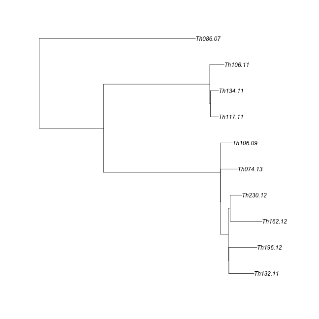
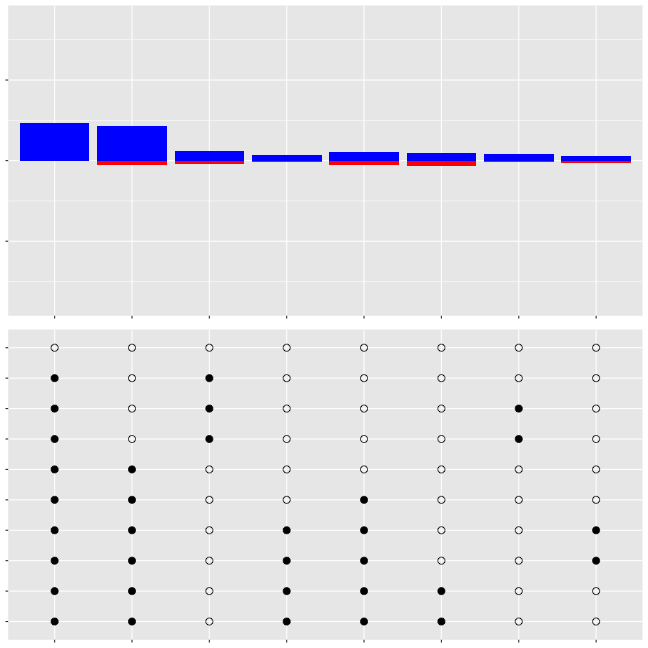
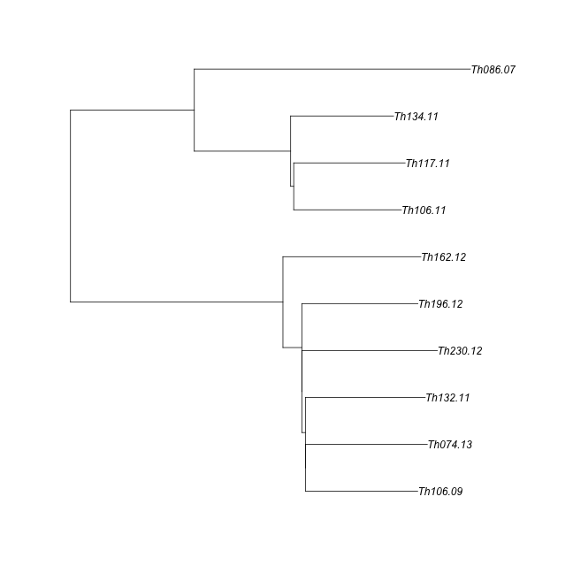
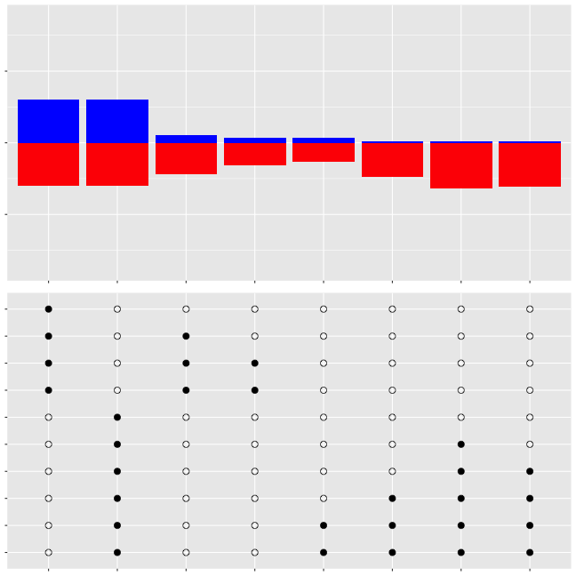
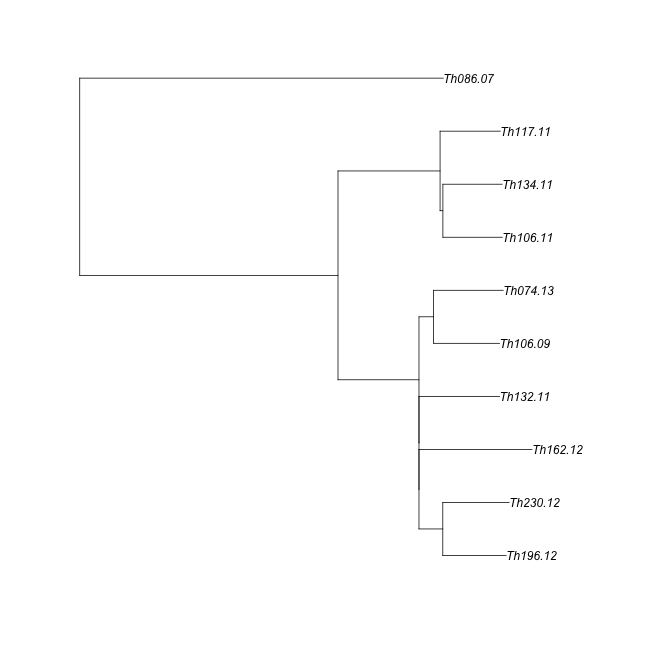
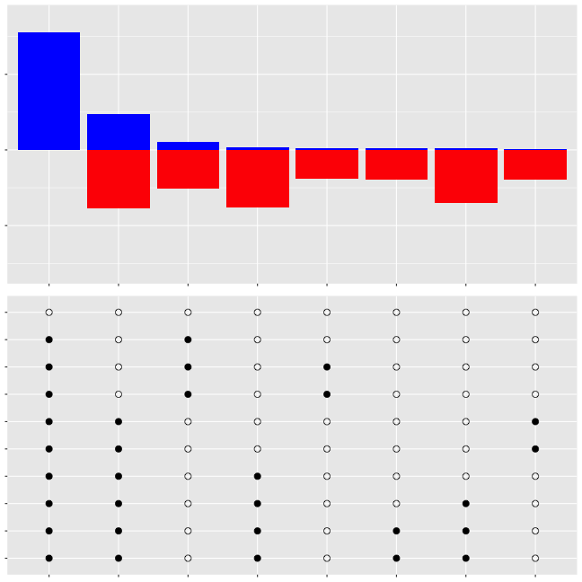

```r
library(ape)
library(adegenet)
library(phangorn)
library(knitr)
library(igraph)
library(RColorBrewer)
library(ggplot2)
library(reshape2)

require(gridExtra)


opts_chunk$set(fig.width=9, fig.height=9)
#opts_chunk$set(dev=c('png','postscript'))
opts_chunk$set(dev=c('png'))
```


```r
sym <- function(M) {
  M[lower.tri(M)] = t(M)[lower.tri(M)]
  M
}


makeDist <- function(distance_matrix_file, meta_file, ngroups=3) {
  mat <- read.table(distance_matrix_file,sep="\t")
  D <- as.dist(sym(mat))
  clust <- gengraph(D,ngrp=ngroups)
  names <- colnames(mat)
  mat <- as.matrix(mat)
  
  name1 <- names[clust$clust$membership==1]
  name2 <- names[clust$clust$membership==2]
  name3 <- names[clust$clust$membership==3]
  dist1 <- mat[name1,name1]
  dist2 <- mat[name2,name2]
  dist3 <- mat[name3,name3]
    
  list(dist1,dist2,dist3)
}
```


```r
getSplitSupports <- function(tree,genos) {
    
#  samps <- c(1:dim(genos)[[1]])
  samps <- tree$tip.label
  
  splitSupports <- data.frame(splits=character(),
                              null=numeric(),
                              irrelevant=numeric(),
                              pro=numeric(),
                              anti=numeric(),
                              stringsAsFactors = F)
  
  splits <- as.splits(tree)
  write(paste(c((length(samps)+1):length(splits)),sep=", "),stderr())
  for (si in c((length(samps)+1):length(splits))) {
    split <- samps[splits[[si]]]
    outs <- samps[!samps %in% split]
    #if (length(split)==1) {next}
    if (length(split)==length(samps)) {next}
    
  #  write(split,stderr())
    calcs <- apply(genos,2,function(x) {
      sAll <- na.omit(unique(x[split]))
      oAll <- na.omit(unique(x[outs]))
      comm <- intersect(sAll,oAll)
      sLen <- length(sAll)
      oLen <- length(oAll)
      cLen <- length(comm)
      if (sLen > 2) {sLen<-2}
      if (oLen > 2) {oLen<-2}
      if (cLen > 1) {cLen<-1}
      cat <- paste(c(sLen,cLen,oLen),sep="",collapse="")
      if (sLen==0 | oLen==0 | cat =="111") {
        return("null") #if null or monomorphic
      }
      if (cat %in% c("101","102","201","202")) {
        return("support")
      }
      if (cat %in% c("112","211")) {
        return("no support")
      }
      if (cat == "212") {
        return("against")
      }
      write(cat,stderr())
        return(cat)
      })
   
      #write(table(calcs),stderr()) 
      # write(paste(split,sep=",",collapse =","),stderr())
      # write(table(calcs)[c("null","no support","support","against")],stderr())
      nextI = dim(splitSupports)[[1]]+1
      splitSupports[nextI,"splits"] = paste(split,sep=",",collapse =",")
      counts <- table(calcs)[c("null","no support","support","against")]
      counts[is.na(counts)] <- 0
      splitSupports[nextI,c("null","irrelevant","pro","anti")] = counts
      
  }
  
  return(splitSupports)
}

getSplitPlot <- function(tree) {
    
#  samps <- c(1:dim(genos)[[1]])
  samps <- tree$tip.label
  
  splitPlot <- data.frame(splits=character(),
                          sample=character(),
                          insplit=numeric(),
                          stringsAsFactors = F)
  
  splits <- as.splits(tree)
  write(paste(c((length(samps)+1):length(splits)),sep=", "),stderr())
  for (si in c((length(samps)+1):length(splits))) {
    split <- samps[splits[[si]]]
    outs <- samps[!samps %in% split]
    #if (length(split)==1) {next}
    if (length(split)==length(samps)) {next}
    
    splitStr = paste(split,sep=",",collapse =",")
    
    write(paste(si,splitStr,length(splits)),stderr())
    for (s in split) {
      nextI = dim(splitPlot)[[1]]+1
      splitPlot[nextI,"splits"] = splitStr
      splitPlot[nextI,"sample"] = s
      splitPlot[nextI,"insplit"] = 1}
    for (s in outs) {
      nextI = dim(splitPlot)[[1]]+1
      splitPlot[nextI,"splits"] = splitStr
      splitPlot[nextI,"sample"] = s
      splitPlot[nextI,"insplit"] = 0}
    
      
  }
  
  treeOrder <- tree$tip.label[tree$edge[c(tree$edge[,2] <= length(tree$tip.label)),2]]
  splitPlot$sample <- factor(splitPlot$sample,levels=treeOrder,ordered=T)
  splitPlot$insplit <- as.logical(splitPlot$insplit)
  return(splitPlot)
}

blankTheme <- theme(axis.title=element_blank(),axis.text = element_blank())
blankThemeLab <- theme(axis.title=element_blank(),axis.text.y = element_blank(),
                    axis.text.x=element_text(angle=90,hjust=1))
```


```r
meta <- read.table("Thies_metadata_1701.txt",sep="\t",header=T)
colnames(meta)[1]<-"name"
meta <- meta[!is.na(meta$Age),]

discoDists <- read.table("thies_disco.FILT.m0.5.vcf.gz.dist.tab.txt",header=T,sep="\t")

meta <- subset(meta,name %in% names(discoDists))
rownames(meta) <- meta$name

hap100Dists <- read.table("thies_haplo100.FILT.m0.5.vcf.gz.dist.tab.txt",header=T,sep="\t")

hap250Dists <- read.table("thies_haplo250.FILT.m0.5.vcf.gz.dist.tab.txt",header=T,sep="\t")


samples <- read.table("../180224_core_callable_VQSLOD90/Thies.samples.txt",col.names=c("ID","lane","dataset","sample","bam"))
samples <- unique(samples[,c("ID","sample")])
snames <- samples[,c("ID")]; samples<- as.character(samples[,c("sample")]) ; names(samples) <- snames

#fix names for hap100 tree
names(hap100Dists) <- samples[rownames(hap100Dists)]
rownames(hap100Dists) <- samples[rownames(hap100Dists)]
```


```r
cl1 <- c("Th086.07", "Th106.09", "Th106.11", "Th117.11", "Th132.11", "Th134.11", "Th162.12", "Th196.12", "Th230.12", "Th074.13")
cl1yrs <- as.numeric(gsub(".*\\.","",cl1))
og1<-"Th166.12"
oc1 <- c("Th166.12", "Th092.13", "Th211.13", "Th245.13", "Th246.13")
cl2 <- c("Th166.12", "Th092.13", "Th211.13", "Th245.13", "Th246.13")
og2<-"Th068.12"
oc2 <- c("Th068.12", "Th061.13", "Th095.13")
cl3 <- c("Th068.12", "Th061.13", "Th095.13")
cog1 <- c(cl1,og1)
cog2 <- c(cl1,og2)
```


#MAKE DISCOVAR TREES

```r
discoAlleles <- read.table("thies_disco.FILT.m0.5.alleles.tab",colClasses="character",header=T,na.strings = c("."))
genos <- t(data.matrix(discoAlleles[6:dim(discoAlleles)[2]]))
inds <- row.names(genos)
genosDat <- as.phyDat(genos, type="USER", levels = c(0:max(genos,na.rm=T)))

# njtree1 <- nj(as.dist(sym(discoDists)))
# njtree1 <- midpoint(njtree1)
# njtree1 <- drop.tip(njtree1,c(oc1,oc2))
# #plot(njtree1)

discoPTree <- pratchet(genosDat) # ,njtree1)
```

```
## [1] "Best pscore so far: 23264"
## [1] "Best pscore so far: 23264"
## [1] "Best pscore so far: 23264"
## [1] "Best pscore so far: 23263"
## [1] "Best pscore so far: 23263"
## [1] "Best pscore so far: 23263"
## [1] "Best pscore so far: 23263"
## [1] "Best pscore so far: 23263"
## [1] "Best pscore so far: 23263"
## [1] "Best pscore so far: 23263"
## [1] "Best pscore so far: 23263"
## [1] "Best pscore so far: 23263"
## [1] "Best pscore so far: 23263"
```

```r
discoPTree <- nnls.phylo(discoPTree,dist.hamming(genosDat))
discoPTree <- midpoint(discoPTree)
discoPTree <- drop.tip(discoPTree,c(oc1,oc2))
plot(discoPTree)
```



```r
#discoLocs <- paste(discoAlleles[,1],discoAlleles[,2])
```


```r
#get support for each split, and split dot matrix
discoPSupp <- getSplitSupports(discoPTree,genos[cl1,])
discoPSplits <- getSplitPlot(discoPTree)

#order by most-supported split
splitSort <- discoPSupp$splits[rev(order(discoPSupp$pro))]
discoPSplits$splits <- factor(discoPSplits$splits,levels=splitSort, ordered=T)

splitP <- ggplot(discoPSplits,aes(x=splits,y=sample,fill=insplit)) + geom_point(shape=21, size=3) + scale_fill_manual(values=c(NA,"black"),guide=F)
discoPSupP <- ggplot(discoPSupp,aes(x=splits)) + geom_bar(aes(y=pro),stat="identity",fill="blue") + geom_bar(aes(y=(anti*-1)),stat="identity",fill="red") + ylim(-1750,1750)
grid.arrange(discoPSupP + blankTheme, splitP+blankTheme, ncol=1)
```



#MAKE Hap250 TREES

```r
hap250Alleles <- read.table("thies_haplo250.FILT.m0.5.alleles.tab",colClasses="character",header=T,na.strings = c("."))
genos <- t(data.matrix(hap250Alleles[6:dim(hap250Alleles)[2]]))
inds <- row.names(genos)
genosDat <- as.phyDat(genos, type="USER", levels = c(0:max(genos,na.rm=T)))

# njtree1 <- nj(as.dist(sym(hap250Dists)))
# njtree1 <- midpoint(njtree1)
# njtree1 <- drop.tip(njtree1,c(oc1,oc2))
# #plot(njtree1)

hap250PTree <- pratchet(genosDat) # ,njtree1)
```

```
## [1] "Best pscore so far: 13429"
## [1] "Best pscore so far: 13429"
## [1] "Best pscore so far: 13429"
## [1] "Best pscore so far: 13429"
## [1] "Best pscore so far: 13429"
## [1] "Best pscore so far: 13429"
## [1] "Best pscore so far: 13429"
## [1] "Best pscore so far: 13429"
## [1] "Best pscore so far: 13429"
## [1] "Best pscore so far: 13429"
```

```r
hap250PTree <- nnls.phylo(hap250PTree,dist.hamming(genosDat))
hap250PTree <- midpoint(hap250PTree)
hap250PTree <- drop.tip(hap250PTree,c(oc1,oc2))
plot(hap250PTree)
```



```r
#hap250Locs <- paste(hap250Alleles[,1],hap250Alleles[,2])
```


```r
#get support for each split, and split dot matrix
hap250PSupp <- getSplitSupports(hap250PTree,genos[cl1,])
hap250PSplits <- getSplitPlot(hap250PTree)

#order by most-supported split
splitSort <- hap250PSupp$splits[rev(order(hap250PSupp$pro))]
hap250PSplits$splits <- factor(hap250PSplits$splits,levels=splitSort, ordered=T)
hap250PSupp$splits <- factor(hap250PSupp$splits,levels=splitSort, ordered=T)

splitP <- ggplot(hap250PSplits,aes(x=splits,y=sample,fill=insplit)) + geom_point(shape=21, size=3) + scale_fill_manual(values=c(NA,"black"),guide=F)

hap250PSupP <- ggplot(hap250PSupp,aes(x=splits)) + geom_bar(aes(y=pro),stat="identity",fill="blue") + geom_bar(aes(y=(anti*-1)),stat="identity",fill="red") + ylim(-1750,1750)
grid.arrange(hap250PSupP + blankTheme, splitP+blankTheme, ncol=1)
```




#MAKE Hap100 TREES

```r
hap100Alleles <- read.table("thies_haplo100.FILT.m0.5.alleles.tab",colClasses="character",header=T,na.strings = c("."))
cnames <- gsub("SM.","SM-",colnames(hap100Alleles))
cnames[cnames %in% names(samples)] <- samples[cnames[cnames %in% names(samples)]]
colnames(hap100Alleles) <- cnames


genos <- t(data.matrix(hap100Alleles[6:dim(hap100Alleles)[2]]))
inds <- row.names(genos)
genosDat <- as.phyDat(genos, type="USER", levels = c(0:max(genos,na.rm=T)))

# njtree1 <- nj(as.dist(sym(hap100Dists)))
# njtree1 <- midpoint(njtree1)
# njtree1 <- drop.tip(njtree1,c(oc1,oc2))
# #plot(njtree1)

hap100PTree <- pratchet(genosDat) # ,njtree1)
```

```
## [1] "Best pscore so far: 19357"
## [1] "Best pscore so far: 19357"
## [1] "Best pscore so far: 19357"
## [1] "Best pscore so far: 19357"
## [1] "Best pscore so far: 19357"
## [1] "Best pscore so far: 19357"
## [1] "Best pscore so far: 19357"
## [1] "Best pscore so far: 19357"
## [1] "Best pscore so far: 19357"
## [1] "Best pscore so far: 19357"
```

```r
hap100PTree <- nnls.phylo(hap100PTree,dist.hamming(genosDat))
hap100PTree <- midpoint(hap100PTree)
hap100PTree <- drop.tip(hap100PTree,c(oc1,oc2))
plot(hap100PTree)
```



```r
#hap100Locs <- paste(hap100Alleles[,1],hap100Alleles[,2])
```


```r
#get support for each split, and split dot matrix
hap100PSupp <- getSplitSupports(hap100PTree,genos[cl1,])
hap100PSplits <- getSplitPlot(hap100PTree)

#order by most-supported split
splitSort <- hap100PSupp$splits[rev(order(hap100PSupp$pro))]
hap100PSplits$splits <- factor(hap100PSplits$splits,levels=splitSort, ordered=T)
hap100PSupp$splits <- factor(hap100PSupp$splits,levels=splitSort, ordered=T)

splitP <- ggplot(hap100PSplits,aes(x=splits,y=sample,fill=insplit)) + geom_point(shape=21, size=3) + scale_fill_manual(values=c(NA,"black"),guide=F)
hap100PSupP <- ggplot(hap100PSupp,aes(x=splits)) + geom_bar(aes(y=pro),stat="identity",fill="blue") + geom_bar(aes(y=(anti*-1)),stat="identity",fill="red") + ylim(-1600,1750)
grid.arrange(hap100PSupP + blankTheme, splitP+blankTheme, ncol=1)
```




```r
#percent support Discovar:
write.table(round(discoPSupp[,3:5] / rowSums(discoPSupp[,3:5]),2),sep="\t",quote=F)
```

```
## irrelevant	pro	anti
## 1	0.69	0.31	0
## 2	0.7	0.26	0.03
## 3	0.91	0.05	0.04
## 4	0.9	0.07	0.03
## 5	0.94	0.05	0.01
## 6	0.95	0.04	0.02
## 7	0.9	0.07	0.02
## 8	0.94	0.05	0.01
```

```r
mean(discoPSupp[,4]/rowSums(discoPSupp[,4:5]))
```

```
## [1] 0.7785412
```

```r
write.table(discoPSupp[,3:5],quote=F) 
```

```
## irrelevant pro anti
## 1 1053 471 0
## 2 1155 433 57
## 3 1493 89 62
## 4 1482 109 50
## 5 1450 77 15
## 6 1463 58 27
## 7 1460 116 40
## 8 1475 71 17
```

```r
#percent support Hap250:
write.table(round(hap250PSupp[,3:5] / rowSums(hap250PSupp[,3:5]),2),sep="\t",quote=F)
```

```
## irrelevant	pro	anti
## 1	0.54	0.23	0.23
## 2	0.75	0.01	0.24
## 3	0.76	0.01	0.23
## 4	0.81	0.01	0.18
## 5	0.87	0.03	0.1
## 6	0.54	0.23	0.23
## 7	0.79	0.04	0.17
## 8	0.86	0.03	0.12
```

```r
mean(hap250PSupp[,4]/rowSums(hap250PSupp[,4:5]))
```

```
## [1] 0.2099631
```

```r
write.table(hap250PSupp[,3:5],quote=F)
```

```
## irrelevant pro anti
## 1 1415 600 602
## 2 1959 19 639
## 3 1989 18 610
## 4 2123 23 471
## 5 2282 66 267
## 6 1415 600 602
## 7 2064 112 437
## 8 2236 66 311
```

```r
#percent support Hap100:
write.table(round(hap100PSupp[,3:5] / rowSums(hap100PSupp[,3:5]),2),sep="\t",quote=F)
```

```
## irrelevant	pro	anti
## 1	0.53	0.47	0
## 2	0.65	0.13	0.22
## 3	0.77	0.01	0.22
## 4	0.8	0.01	0.2
## 5	0.88	0.01	0.11
## 6	0.89	0	0.11
## 7	0.82	0.03	0.15
## 8	0.89	0.01	0.11
```

```r
mean(hap100PSupp[,4]/rowSums(hap100PSupp[,4:5]))
```

```
## [1] 0.2208524
```

```r
write.table(hap100PSupp[,3:5],quote=F)
```

```
## irrelevant pro anti
## 1 1733 1559 0
## 2 2294 470 769
## 3 2734 33 766
## 4 2813 19 696
## 5 3112 21 394
## 6 3128 16 388
## 7 2908 109 516
## 8 3132 22 378
```

