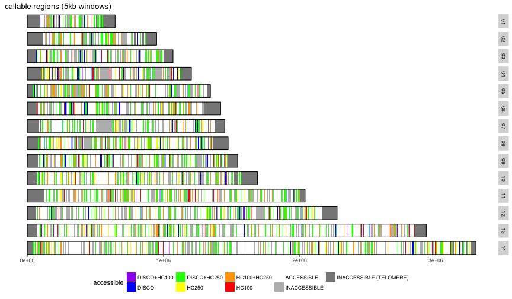
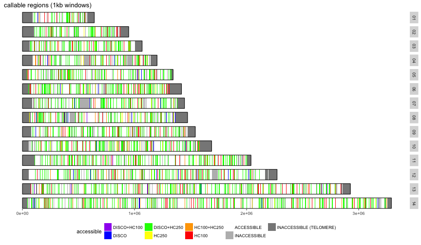
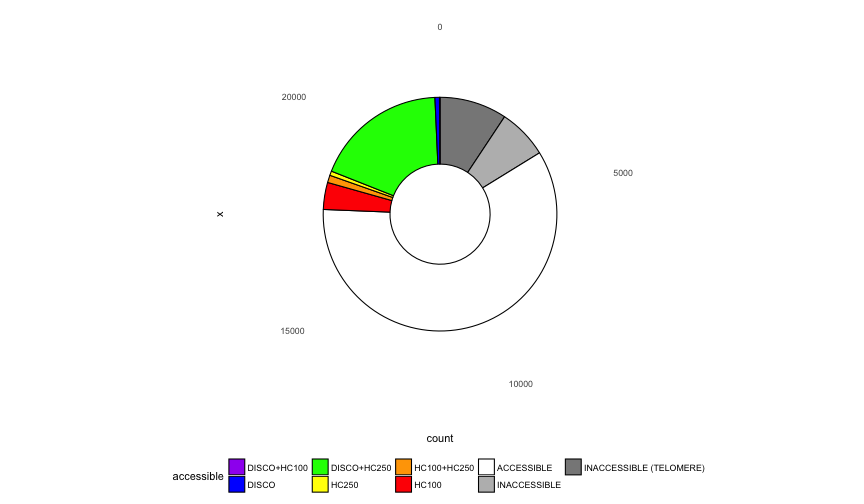
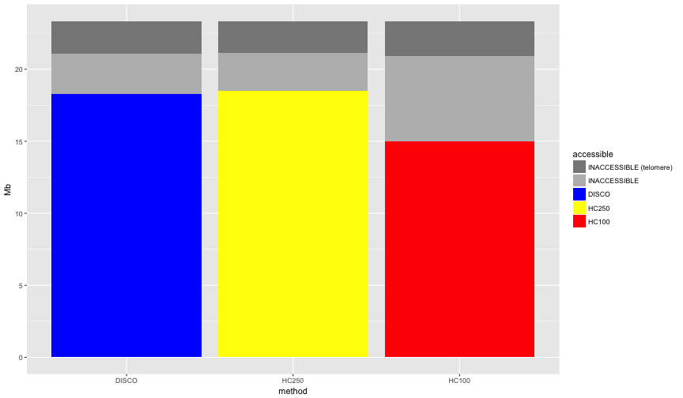

```r
library(ggplot2)
library(knitr)
library(reshape2)
library(hexbin)
opts_chunk$set(fig.width=12, fig.height=7, fig.path="figure/chrs-")
opts_chunk$set(dev=c('png','postscript'))
```


```r
telos <- readLines("List.subtelomeres.3D7.regions.txt")
telos <- t(as.data.frame(strsplit(telos,split = ':')))
telos <- as.data.frame(cbind(telos[,1],t(as.data.frame(strsplit(telos[,2],split = '-')))))
colnames(telos) <- c("chr","st","en")
telos$st <- as.numeric(as.character(telos$st))
telos$en <- as.numeric(as.character(telos$en))
levels(telos$chr) <- c("01","02","03","04","05","06","07","08","09","10","11","12","13","14")

telos <- merge(subset(telos,st < 1000),subset(telos,st > 1000),by="chr")
colnames(telos) <- c("chr","stL","enL","stR","enR")
```


```r
calcols <- c("chr","st","en","NV","LDfails","LDpass","RSfails","RSpass","df","dn","Dpass","multipass")
callable_disco <- read.table("callable_blocks_fakeNGS_disco.F100.d34-74.5K.SI.txt",stringsAsFactors = T,sep='\t',header=F,col.names = calcols)
callable_HC100 <- read.table("callable_blocks_fakeNGS_haplo_rl100.F100.d34-74.5K.SI.txt",stringsAsFactors = T,sep='\t',header=F,col.names = calcols)
callable_HC250 <- read.table("callable_blocks_fakeNGS_haplo_rl250.F100.d34-74.5K.SI.txt",stringsAsFactors = T,sep='\t',header=F,col.names = calcols)

callable_disco <- callable_disco[,c(1,2,3,12)]
callable_HC100 <- callable_HC100[,c(1,2,3,12)]
callable_HC250 <- callable_HC250[,c(1,2,3,12)]
colnames(callable_disco)[[4]] <- "disco"
colnames(callable_HC100)[[4]] <- "HC100"
colnames(callable_HC250)[[4]] <- "HC250"
callable_HC100$HC100 = callable_HC100$HC100=="True"
callable_HC250$HC250 = callable_HC250$HC250=="True"
callable_disco$disco = callable_disco$disco=="True"

callable<-merge(merge(callable_disco,callable_HC100),callable_HC250)
# callable$accessible <- NULL
# callable[callable$disco=="True" & callable$haplo=="False","accessible"] <- "DISCOVAR only"
# callable[callable$disco=="False" & callable$haplo=="True","accessible"] <- "haplo only"
# callable[callable$disco=="False" & callable$haplo=="False","accessible"] <- "inacessible"

levels(callable$chr) <- c("MIT","01","02","03","04","05","06","07","08","09","10","11","12","13","14","API")
callable <- subset(callable,!chr %in% c("MIT","API"))


callable$telo=F
tmp <- merge(callable,telos,by="chr",all.x=T)

tmp[is.na(tmp$stL),c("stL","enL","stR","enR")] <- -1
tmp$telo[tmp$en < tmp$enL] = T # "L"
tmp$telo[tmp$st > tmp$stR] = T # "R"
callable <- tmp[,colnames(callable)]
rm(tmp)
```


```r
callable$accessible<-NA
callable$accessible[is.na(callable$accessible) & (callable$disco & callable$HC100 & callable$HC250)] <- "ACCESSIBLE"
callable$accessible[is.na(callable$accessible) & (callable$HC100 & callable$HC250)] <- "HC100+HC250"
callable$accessible[is.na(callable$accessible) & (callable$disco & callable$HC250)] <- "DISCO+HC250"
callable$accessible[is.na(callable$accessible) & (callable$disco & callable$HC100)] <- "DISCO+HC100"
callable$accessible[is.na(callable$accessible) & (callable$disco)] <- "DISCO"
callable$accessible[is.na(callable$accessible) & (callable$HC100)] <- "HC100"
callable$accessible[is.na(callable$accessible) & (callable$HC250)] <- "HC250"
callable$accessible[is.na(callable$accessible) & callable$telo] <- "INACCESSIBLE (TELOMERE)"
callable$accessible[is.na(callable$accessible)] <- "INACCESSIBLE"

cats <- c("DISCO+HC100","DISCO","DISCO+HC250","HC250","HC100+HC250","HC100",
          "ACCESSIBLE","INACCESSIBLE",
          "INACCESSIBLE (TELOMERE)")
callable$accessible <- factor(callable$accessible,levels=cats)
catcols <- c("purple","blue","green","yellow","orange","red",
          
          "white","#BBBBBB","#888888")
names(catcols)<-cats
```


```r
chrlen <- as.data.frame(aggregate(callable$en,list(callable$chr),FUN=max))
chrlen$st=1
colnames(chrlen) <- c("chr","st","en")
```


```r
blank_theme <-   theme(axis.line.y=element_blank(), axis.ticks.y=element_blank(),axis.text.y=element_blank(),
        panel.background=element_blank(),panel.grid.major = element_blank(), panel.grid.minor = element_blank(),
        legend.position="bottom")

ggplot(callable,aes(xmin=st,xmax=en,ymin=0,ymax=1)) + 
  ggtitle(paste("callable regions (5kb windows)")) +
  geom_rect(aes(fill=accessible)) + scale_fill_manual(values=catcols)+
  geom_rect(data=chrlen,fill=NA,colour="black") + 
  facet_grid(chr ~ .)   + theme(axis.text.y = element_blank(),axis.ticks.y=element_blank(),legend.position="bottom") +
  theme(panel.background = element_rect(fill='white'), panel.grid.major = element_blank(), panel.grid.minor = element_blank())
```




#CALLABLE 1KB WINDOWS

```r
calcols <- c("chr","st","en","NV","LDfails","LDpass","RSfails","RSpass","df","dn","Dpass","multipass")
callable_disco <- read.table("callable_blocks_fakeNGS_disco.F100.d34-74.1K.SI.txt",stringsAsFactors = T,sep='\t',header=F,col.names = calcols)
callable_HC100 <- read.table("callable_blocks_fakeNGS_haplo_rl100.F100.d34-74.1K.SI.txt",stringsAsFactors = T,sep='\t',header=F,col.names = calcols)
callable_HC250 <- read.table("callable_blocks_fakeNGS_haplo_rl250.F100.d34-74.1K.SI.txt",stringsAsFactors = T,sep='\t',header=F,col.names = calcols)

callable_disco <- callable_disco[,c(1,2,3,12)]
callable_HC100 <- callable_HC100[,c(1,2,3,12)]
callable_HC250 <- callable_HC250[,c(1,2,3,12)]
colnames(callable_disco)[[4]] <- "disco"
colnames(callable_HC100)[[4]] <- "HC100"
colnames(callable_HC250)[[4]] <- "HC250"
callable_HC100$HC100 = callable_HC100$HC100=="True"
callable_HC250$HC250 = callable_HC250$HC250=="True"
callable_disco$disco = callable_disco$disco=="True"

callable<-merge(merge(callable_disco,callable_HC100),callable_HC250)
# callable$accessible <- NULL
# callable[callable$disco=="True" & callable$haplo=="False","accessible"] <- "DISCOVAR only"
# callable[callable$disco=="False" & callable$haplo=="True","accessible"] <- "haplo only"
# callable[callable$disco=="False" & callable$haplo=="False","accessible"] <- "inacessible"

levels(callable$chr) <- c("MIT","01","02","03","04","05","06","07","08","09","10","11","12","13","14","API")
callable <- subset(callable,!chr %in% c("MIT","API"))


callable$telo=F
tmp <- merge(callable,telos,by="chr",all.x=T)

tmp[is.na(tmp$stL),c("stL","enL","stR","enR")] <- -1
tmp$telo[tmp$en < tmp$enL] = T # "L"
tmp$telo[tmp$st > tmp$stR] = T # "R"
callable <- tmp[,colnames(callable)]
rm(tmp)
```


```r
callable$accessible<-NA
callable$accessible[is.na(callable$accessible) & (callable$disco & callable$HC100 & callable$HC250)] <- "ACCESSIBLE"
callable$accessible[is.na(callable$accessible) & (callable$HC100 & callable$HC250)] <- "HC100+HC250"
callable$accessible[is.na(callable$accessible) & (callable$disco & callable$HC250)] <- "DISCO+HC250"
callable$accessible[is.na(callable$accessible) & (callable$disco & callable$HC100)] <- "DISCO+HC100"
callable$accessible[is.na(callable$accessible) & (callable$disco)] <- "DISCO"
callable$accessible[is.na(callable$accessible) & (callable$HC100)] <- "HC100"
callable$accessible[is.na(callable$accessible) & (callable$HC250)] <- "HC250"
callable$accessible[is.na(callable$accessible) & callable$telo] <- "INACCESSIBLE (TELOMERE)"
callable$accessible[is.na(callable$accessible)] <- "INACCESSIBLE"

cats <- c("DISCO+HC100","DISCO","DISCO+HC250","HC250","HC100+HC250","HC100",
          "ACCESSIBLE","INACCESSIBLE",
          "INACCESSIBLE (TELOMERE)")
callable$accessible <- factor(callable$accessible,levels=cats)
catcols <- c("purple","blue","green","yellow","orange","red",
          
          "white","#BBBBBB","#888888")
names(catcols)<-cats
```


```r
chrlen <- as.data.frame(aggregate(callable$en,list(callable$chr),FUN=max))
chrlen$st=1
colnames(chrlen) <- c("chr","st","en")
```


```r
blank_theme <-   theme(axis.line.y=element_blank(), axis.ticks.y=element_blank(),axis.text.y=element_blank(),
        panel.background=element_blank(),panel.grid.major = element_blank(), panel.grid.minor = element_blank(),
        legend.position="bottom")

ggplot(callable,aes(xmin=st,xmax=en,ymin=0,ymax=1)) + 
  ggtitle(paste("callable regions (1kb windows)")) +
  geom_rect(aes(fill=accessible)) + scale_fill_manual(values=catcols)+
  geom_rect(data=chrlen,fill=NA,colour="black") + 
  facet_grid(chr ~ .)   + theme(axis.text.y = element_blank(),axis.ticks.y=element_blank(),legend.position="bottom") +
  theme(panel.background = element_rect(fill='white'), panel.grid.major = element_blank(), panel.grid.minor = element_blank())
```




#bar chart (1kb)

```r
callableTab <- as.data.frame(table(callable$accessible))
colnames(callableTab) <- c("accessible","count")
callableTab$pc <- round(callableTab$count / sum(callableTab$count),2)

write.table(callableTab,sep="\t",quote=F,row.names = F)
```

```
## accessible	count	pc
## DISCO+HC100	18	0
## DISCO	145	0.01
## DISCO+HC250	4264	0.18
## HC250	140	0.01
## HC100+HC250	238	0.01
## HC100	870	0.04
## ACCESSIBLE	13847	0.59
## INACCESSIBLE	1607	0.07
## INACCESSIBLE (TELOMERE)	2170	0.09
```

```r
ggplot(callableTab,aes(x="",y=count,fill=accessible)) + 
  geom_bar(width = 0.4,stat="identity",position="stack",colour="black") + scale_fill_manual(values=catcols)+
  coord_polar("y")+
  blank_theme
```



#bar chart

```r
callable_disco <- read.table("callable_blocks_fakeNGS_disco.F100.d34-74.1K.SI.txt",stringsAsFactors = T,sep='\t',header=F,col.names = calcols)
callable_HC100 <- read.table("callable_blocks_fakeNGS_haplo_rl100.F100.d34-74.1K.SI.txt",stringsAsFactors = T,sep='\t',header=F,col.names = calcols)
callable_HC250 <- read.table("callable_blocks_fakeNGS_haplo_rl250.F100.d34-74.1K.SI.txt",stringsAsFactors = T,sep='\t',header=F,col.names = calcols)

callable_disco$accessible <- "INACCESSIBLE"
callable_HC250$accessible <- "INACCESSIBLE"
callable_HC100$accessible <- "INACCESSIBLE"
callable_disco$accessible[callable_disco$multipass=="True"] <- "DISCO"
callable_HC250$accessible[callable_HC250$multipass=="True"] <- "HC250"
callable_HC100$accessible[callable_HC100$multipass=="True"] <- "HC100"

callable_disco <- callable_disco[,c(1,2,3,13)]
callable_HC100 <- callable_HC100[,c(1,2,3,13)]
callable_HC250 <- callable_HC250[,c(1,2,3,13)]

callable_disco$method<-"DISCO"
callable_HC250$method<-"HC250"
callable_HC100$method<-"HC100"
callableSt <- (rbind(callable_disco,callable_HC250,callable_HC100))
callableSt$method <- factor(callableSt$method,levels=c("DISCO","HC250","HC100"))
callableSt$accessible <- factor(callableSt$accessible,levels=c("INACCESSIBLE (telomere)","INACCESSIBLE",
                                                               "DISCO","HC250","HC100"))
levels(callableSt$chr) <- c("MIT","01","02","03","04","05","06","07","08","09","10","11","12","13","14","API")

#MARK OUT TELOMERES
for (i in c(0:dim(telos)[[1]]) ) {
  c <- as.character(telos[i,"chr"])
  s <- telos[i,"stL"]; e <- telos[i,"enL"];
  callableSt[callableSt$accessible=="INACCESSIBLE" &
               (callableSt$chr==c & callableSt$en<e & callableSt$st>s),"accessible"] <- "INACCESSIBLE (telomere)"
  s <- telos[i,"stR"]; e <- telos[i,"enR"];
  callableSt[callableSt$accessible=="INACCESSIBLE" &
               (callableSt$chr==c & callableSt$en<e & callableSt$st>s),"accessible"] <- "INACCESSIBLE (telomere)"
}

ggplot(callableSt,aes(x=method,fill=accessible)) + 
  geom_bar(position="stack") + scale_fill_manual(values=c("#888888","#BBBBBB","blue","yellow","red")) +
  scale_y_continuous(breaks=seq(0,25000,5000),labels=seq(0,25,5),name="Mb")
```




