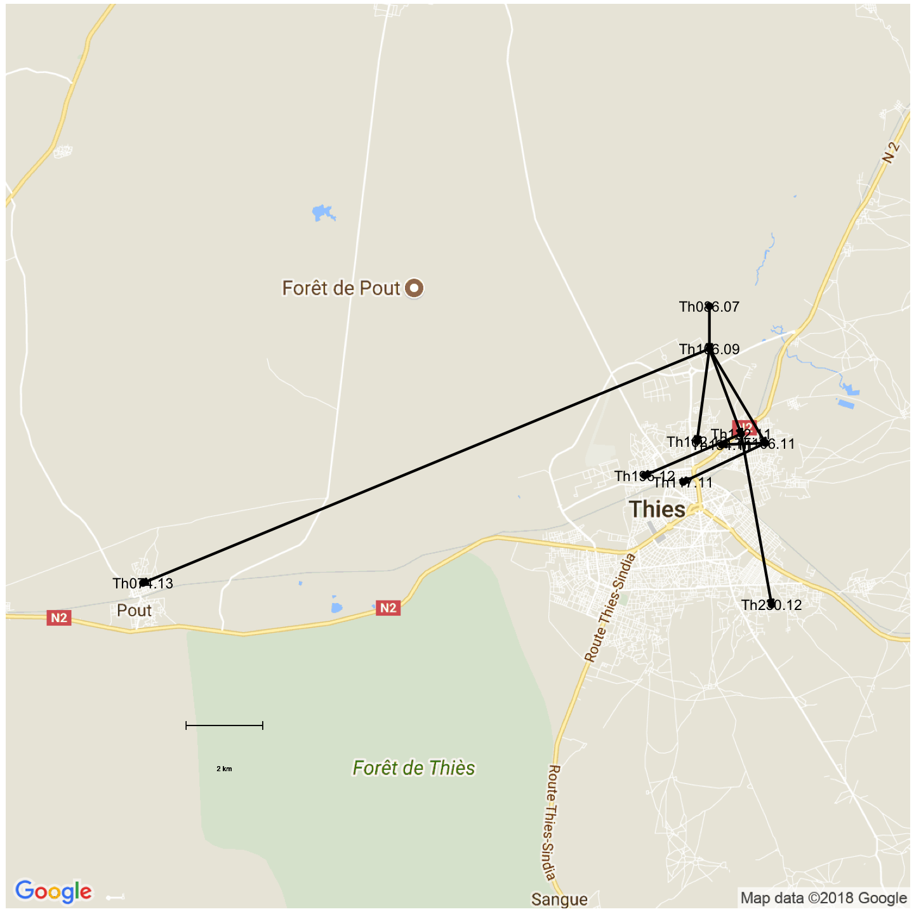
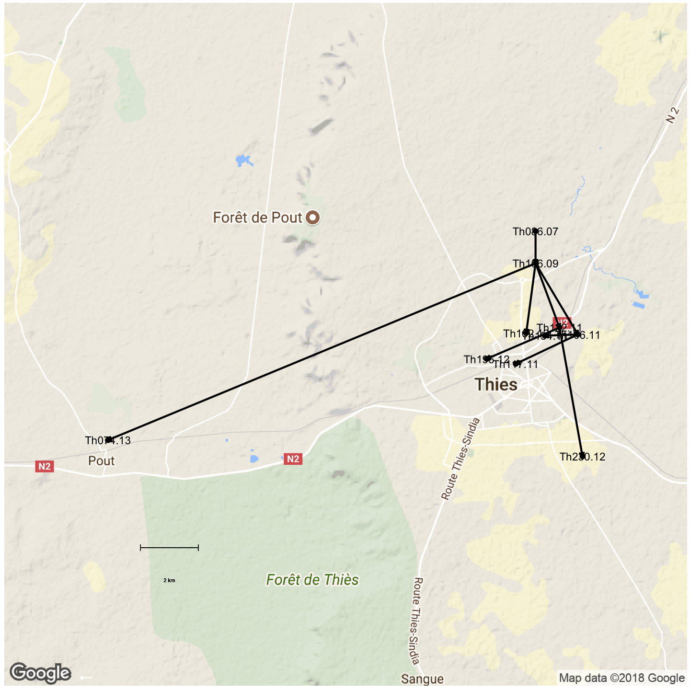
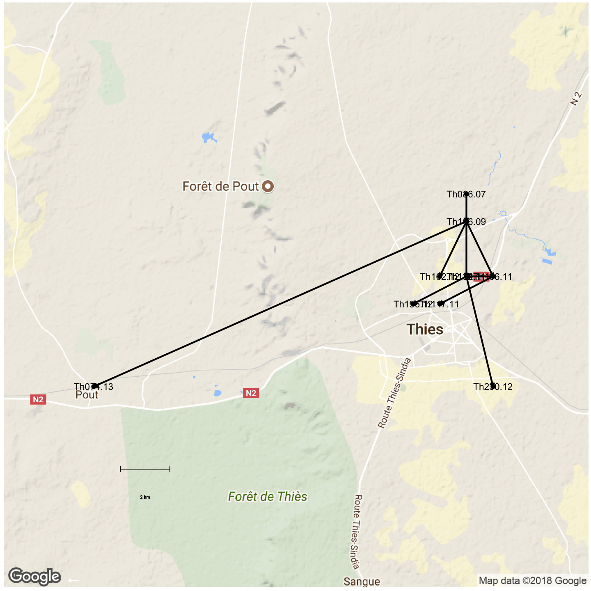

```r
library(ape)
library(adegenet)
library(knitr)
library(igraph)
library(RColorBrewer)
library(gridExtra)
library(ggmap)
library(ggnetwork)
opts_chunk$set(fig.width=9, fig.height=9)
opts_chunk$set(dev=c('png','postscript'))
```


```r
sym <- function(M) {
  M[lower.tri(M)] = t(M)[lower.tri(M)]
  M
}

makeNet <- function(distance_matrix, meta_file, ngroups=3) {
  if (class(distance_matrix)=="dist") {
    D = distance_matrix
    mat <- as.matrix(D)
  } else {
    mat <- read.table(distance_matrix,sep="\t")
    D <- as.dist(sym(mat))
    }
  
  clust <- gengraph(D,ngrp=3)
  names <- colnames(mat)
  mat <- as.matrix(mat)

  meta <- read.table("Thies_metadata_1701.txt",sep="\t",header=T)
  colnames(meta)[1]<-"name"
  meta <- meta[!is.na(meta$Age),]

  rownames(meta) <- meta$name
  meta <- meta[names,]
  coll <- as.Date(as.character(meta$Date),"%d/%m/%Y",origin = "2000-01-01")
  #coll <- as.Date(paste("1","jan",meta$year,sep=""),"%d%b%Y")
  names(coll)<-meta$name
  meta$year <- as.numeric(format(coll,'%Y'))+2000

  
#   meta <- read.table("daniels.thies.CA.txt",sep="\t",header=T)
#   rownames(meta) <- meta$name
#   meta <- meta[names,]
#   coll <- as.Date(paste("1","jan",meta$year,sep=""),"%d%b%Y")
#   names(coll)<-meta$name

  name1 <- names[clust$clust$membership==1]
  name2 <- names[clust$clust$membership==2]
  name3 <- names[clust$clust$membership==3]
  year1 <- meta$year[clust$clust$membership==1]
  year2 <- meta$year[clust$clust$membership==2]
  year3 <- meta$year[clust$clust$membership==3]
  coll1 <- coll[name1]
  coll2 <- coll[name2]
  coll3 <- coll[name3]
  dist1 <- mat[name1,name1]
  dist2 <- mat[name2,name2]
  dist3 <- mat[name3,name3]
  
  res1 <- seqTrack(dist1, x.names=name1, x.dates=coll1)
  res2 <- seqTrack(dist2, x.names=name2, x.dates=coll2)
  res3 <- seqTrack(dist3, x.names=name3, x.dates=coll3)

  res1$year <- year1
  res2$year <- year2
  res3$year <- year3
  res1$name <- name1
  res2$name <- name2
  res3$name <- name3
  
  list(res1,res2,res3)
}
```


```r
corefile <- "thies_disco.callAll.FILT.m0.5.dist.tab.txt"
extendedfile <- "thies_disco.FILT.m0.5.dist.tab.txt"
distmatCore <- as.dist(sym(read.table(corefile,sep="\t")))
distmatAll <- as.dist(sym(read.table(extendedfile,sep="\t")))
distmatExt <- distmatAll-distmatCore

varNets <- makeNet(distmatAll)
net <- varNets[[1]]
inds <- rownames(net)
```


```r
meta <- read.table("Thies_metadata_1701.txt",sep="\t",header=T)
colnames(meta)[1]<-"name"
meta <- meta[meta$name %in% inds,]
row.names(meta) <- inds
meta$Date <- as.Date(as.character(meta$Date),"%d/%m/%Y",origin = "2000-01-01")
```


```r
#nb: lat=Y, lon=X
meta$GPS <- as.character(meta$GPS)
meanLat <- mean(as.numeric(t(as.data.frame(strsplit(meta$GPS,", ")[3:10]))[,1]))
meanLon <- mean(as.numeric(t(as.data.frame(strsplit(meta$GPS,", ")[3:10]))[,2]))
maxLat <- max(as.numeric(t(as.data.frame(strsplit(meta$GPS,", ")[3:10]))[,1]))
medianLon <- median(as.numeric(t(as.data.frame(strsplit(meta$GPS,", ")[3:10]))[,2]))
#if this isn't Thies you're in trouble...
meta$GPS[1] <- paste(maxLat+0.03,medianLon,sep=", ")
meta$GPS[2] <- paste(maxLat+0.02,medianLon,sep=", ")
gpspos <- matrix(as.numeric(t(as.data.frame(strsplit(meta$GPS,", ")))),ncol = 2)
#reverse for plotting
gpspos <- gpspos[,c(2,1)]
gpscurves <- rep(0,14)
#gpscurves[c(2,4,5)] <- c(-1,-1,20)
gpscurves[c(2,5)] <- c(+0.2,0)
```


```r
opts_chunk$set(fig.width=20, fig.height=20)
opts_chunk$set(dev=c('png','postscript'))
```


```r
#igApure <- igA
igA <- as.igraph(net)
E(igA)$latend <- gpspos[2:10,2]
E(igA)$lonend <- gpspos[2:10,1]
E(igA)$lat <- gpspos[na.omit(net$ances),2]
E(igA)$lon <- gpspos[na.omit(net$ances),1]

igf <- fortify(net)
igf$vertex.names <- as.character(igf$name)
igf$vertex.names[1:10] <- inds
igf$lat <- gpspos[,2]
igf$lon <- gpspos[,1]
igf$latend[!is.na(igf$weight)] <- gpspos[na.omit(net$ances),2]
igf$lonend[!is.na(igf$weight)] <- gpspos[na.omit(net$ances),1]
igf
```

```
##          id ances weight       date ances.date year     name vertex.names
## Th086.07  1    NA     NA 0007-10-11       <NA> 2007 Th086.07     Th086.07
## Th106.09  2     1    576 0009-10-26 0007-10-11 2009 Th106.09     Th106.09
## Th106.11  3     2    358 0011-10-27 0009-10-26 2011 Th106.11     Th106.11
## Th117.11  4     3    111 0011-11-02 0011-10-27 2011 Th117.11     Th117.11
## Th132.11  5     2    121 0011-11-11 0009-10-26 2011 Th132.11     Th132.11
## Th134.11  6     3    105 0011-11-14 0011-10-27 2011 Th134.11     Th134.11
## Th162.12  7     2    125 0012-10-10 0009-10-26 2012 Th162.12     Th162.12
## Th196.12  8     5    139 0012-10-25 0011-11-11 2012 Th196.12     Th196.12
## Th230.12  9     5    106 0012-11-09 0011-11-11 2012 Th230.12     Th230.12
## Th074.13 10     2     88 0013-09-23 0009-10-26 2013 Th074.13     Th074.13
##               lat       lon   latend    lonend
## Th086.07 14.83849 -16.92289       NA        NA
## Th106.09 14.82849 -16.92289 14.83849 -16.92289
## Th106.11 14.80636 -16.90927 14.82849 -16.92289
## Th117.11 14.79721 -16.92927 14.80636 -16.90927
## Th132.11 14.80849 -16.91518 14.82849 -16.92289
## Th134.11 14.80596 -16.91990 14.80636 -16.90927
## Th162.12 14.80681 -16.92588 14.82849 -16.92289
## Th196.12 14.79876 -16.93862 14.80849 -16.91518
## Th230.12 14.76843 -16.90779 14.80849 -16.91518
## Th074.13 14.77348 -17.06051 14.82849 -16.92289
```

```r
#get 1km in lat
# round(min(gpspos[,2]),2) - 14.77 
#posn of legend:
legend_lat = 14.74
legend_lon = -17.05
#convert to rad
legend_lat_rad<-(legend_lat * pi) / (180)
lon1km = 1/(111.320*cos(legend_lat_rad))

scalelen = 2


#igf[,c("lat","lon","latend","lonend")] <- round((igf[,c("lat","lon","latend","lonend")]*2),3)/2

thies_road <- get_map(location=c(min(gpspos[,1])-b,min(gpspos[,2])-b,max(gpspos[,1])-b,max(gpspos[,2]-b)),zoom=12,maptype = "roadmap")
```

```
## converting bounding box to center/zoom specification. (experimental)
```

```
## Map from URL : http://maps.googleapis.com/maps/api/staticmap?center=14.80346,-16.984151&zoom=12&size=640x640&scale=2&maptype=roadmap&language=en-EN&sensor=false
```

```r
ggmap(thies_road)+
geom_point(data=igf, aes(x = lon, y = lat), size=5) +
geom_text(data=igf,aes(label = name), size=8) +
geom_edges(data = igf[!is.na(igf$weight),],aes(x = lonend, y = latend, xend = lon, yend = lat),arrow=arrow(length = unit(8, "pt"), type = "closed"),colour="black",size=2) + 
  theme_blank()+
  geom_segment(aes(x=legend_lon,y=legend_lat,yend=legend_lat,xend=legend_lon+(lon1km*scalelen)),inherit.aes=F)+
  geom_segment(aes(x=legend_lon,y=legend_lat-0.001,yend=legend_lat+0.001,xend=legend_lon),inherit.aes=F) + 
  geom_segment(aes(x=legend_lon+(lon1km*scalelen),y=legend_lat-0.001,yend=legend_lat+0.001,xend=legend_lon+(lon1km*scalelen)),inherit.aes=F) +
  geom_text(aes(x=legend_lon+(lon1km*scalelen/2),y=legend_lat-0.01),label=paste(scalelen,"km"))
```



```r
thies_terr <- get_map(location=c(min(gpspos[,1])-b,min(gpspos[,2])-b,max(gpspos[,1])-b,max(gpspos[,2]-b)),zoom=12,maptype = "terrain")
```

```
## converting bounding box to center/zoom specification. (experimental)
```

```
## Map from URL : http://maps.googleapis.com/maps/api/staticmap?center=14.80346,-16.984151&zoom=12&size=640x640&scale=2&maptype=terrain&language=en-EN&sensor=false
```

```r
ggmap(thies_terr)+
geom_point(data=igf, aes(x = lon, y = lat), size=5) +
geom_text(data=igf,aes(label = name), size=8) +
geom_edges(data = igf[!is.na(igf$weight),],aes(x = lonend, y = latend, xend = lon, yend = lat),arrow=arrow(length = unit(8, "pt"), type = "closed"),colour="black",size=2) +
theme_blank()+ 
  geom_segment(aes(x=legend_lon,y=legend_lat,yend=legend_lat,xend=legend_lon+(lon1km*scalelen)),inherit.aes=F)+
  geom_segment(aes(x=legend_lon,y=legend_lat-0.001,yend=legend_lat+0.001,xend=legend_lon),inherit.aes=F) + 
  geom_segment(aes(x=legend_lon+(lon1km*scalelen),y=legend_lat-0.001,yend=legend_lat+0.001,xend=legend_lon+(lon1km*scalelen)),inherit.aes=F) +
  geom_text(aes(x=legend_lon+(lon1km*scalelen/2),y=legend_lat-0.01),label=paste(scalelen,"km"))
```



```r
#rounded lat/lon values
igf[,c("lat","lon","latend","lonend")] <- round(igf[,c("lat","lon","latend","lonend")],2)

ggmap(thies)+
geom_point(data=igf, aes(x = lon, y = lat), size=5) +
geom_text(data=igf,aes(label = name), size=8) +
geom_edges(data = igf[!is.na(igf$weight),],aes(x = lonend, y = latend, xend = lon, yend = lat),arrow=arrow(length = unit(8, "pt"), type = "closed"),colour="black",size=2) + geom_segment(aes(x=legend_lon,y=legend_lat,yend=legend_lat,xend=legend_lon+(lon1km*scalelen)),inherit.aes=F)+
  geom_segment(aes(x=legend_lon,y=legend_lat-0.001,yend=legend_lat+0.001,xend=legend_lon),inherit.aes=F) +
  geom_segment(aes(x=legend_lon+(lon1km*scalelen),y=legend_lat-0.001,yend=legend_lat+0.001,xend=legend_lon+(lon1km*scalelen)),inherit.aes=F) +
  geom_text(aes(x=legend_lon+(lon1km*scalelen/2),y=legend_lat-0.01),label=paste(scalelen,"km"))+
theme_blank()
```


