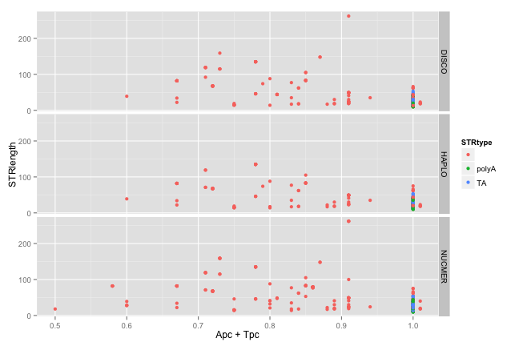
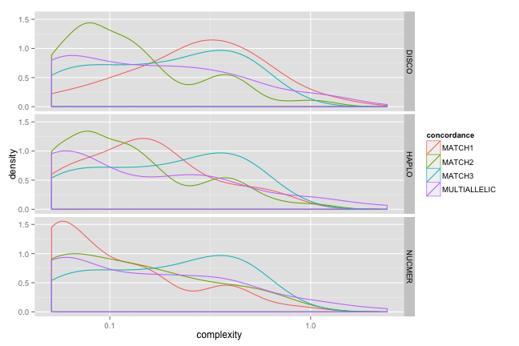
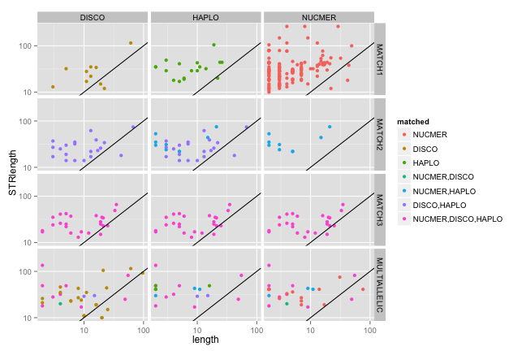

library(ggplot2)
library(knitr)

```r
opts_chunk$set(fig.width=9, fig.height=6)
```


```r
#150626 - indel stats, but no STR/mreps stats
#nuccfs <- read.table("pairwise_nucmer_discovar_cfs_150626.txt",sep="\t",stringsAsFactors = F)
#150629 - indel stats and STR/mreps stats
nuccfs <- read.table("cfNucmerDiscoHaplo_150714.txt",sep="\t",stringsAsFactors = F)
colnames(nuccfs) <- c("file","chr","pos","type","concordance","matched","quality","length","alleles","complexity",
                      "STR","period","exponent","STRlength",
                      "STRcomplexity","Apc","Tpc","Cpc","Gpc" )
matchlevels <- c("","NUCMER","DISCO","HAPLO","NUCMER,DISCO","NUCMER,HAPLO","DISCO,HAPLO","NUCMER,DISCO,HAPLO")
nuccfs$matched <- factor(nuccfs$matched,levels = matchlevels)
```


```r
nuccfs$polyA = (nuccfs$Apc==1 | nuccfs$Tpc==1)
nuccfs$TA = (nuccfs$Apc==0.5 & nuccfs$Tpc==0.5)
nuccfs$STRtype=""
nuccfs[nuccfs$TA,]$STRtype = "TA"
nuccfs[nuccfs$polyA,]$STRtype = "polyA"

#remove nucmer matches to prevent double counting (leave discovar matches untouched)
#nuccfs <- nuccfs[!(nuccfs$prog=="NUC" & nuccfs$concordance=="MATCH"),]

nuccfs$quality <- as.numeric(nuccfs$quality)
#nuccfs[is.na(as.numeric(nuccfs$quality)),]
#REMOVE MISMATCHES (messy/infrequent)
nuccfs <- nuccfs[which(nuccfs$concordance!="MISMATCH"),]
```


```r
cfhaplo <- nuccfs[grep("HAPLO", nuccfs$matched),]
cfhaplo$prog="HAPLO"
cfdisco <- nuccfs[grep("DISCO", nuccfs$matched),]
cfdisco$prog="DISCO"
cfnucmer <- nuccfs[grep("NUCMER", nuccfs$matched),]
cfnucmer$prog="NUCMER"
nuccfs_ind <- rbind(cfhaplo,cfdisco,cfnucmer)
```

#indel metrics
##length

```r
indel_length <- ggplot(subset(nuccfs_ind,type=="INDEL"),aes(y=length,x=matched, colour=concordance)) + 
  geom_jitter() + geom_hline(y=50,linetype=2) + scale_y_log10()
indel_length
```

 

```r
indel_lengthD <- ggplot(subset(nuccfs_ind,type=="INDEL" & concordance != "MULTIALLELIC"),aes(x=length,group=concordance, colour=concordance)) + 
  geom_density() + facet_grid(prog ~ type) + geom_vline(x=50,linetype=2) + scale_x_log10()
indel_lengthD
```

 
###complexity
(ratio of string length to bz comp string length)

```r
indel_complexity <- ggplot(subset(nuccfs_ind,type=="INDEL"),aes(y=complexity,x=matched, colour=matched)) + geom_boxplot() + scale_y_log10()
indel_complexityD <- ggplot(subset(nuccfs_ind,(type=="INDEL" & concordance != "MISMATCH")),aes(x=complexity,group=concordance, colour=concordance)) + 
                      geom_density() + facet_grid(prog ~ .) + scale_x_log10()
indel_complexity
```

 

```r
indel_complexityD
```

 

###length v complexity

```r
indel_len_complex <- ggplot(subset(nuccfs,type=="INDEL"),aes(y=complexity,x=length, colour=matched)) + geom_point() + 
  scale_y_log10() + scale_x_log10()
indel_len_complex
```

 
###no of alleles

```r
alleles <- ggplot(subset(nuccfs,type=="INDEL"),aes(x=alleles,fill=matched)) + geom_bar(binwidth=1) + facet_grid(concordance ~ ., scales ="free_y")
alleles
```

 

